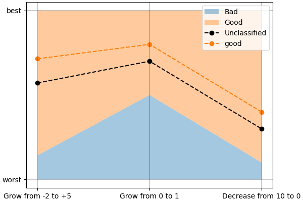
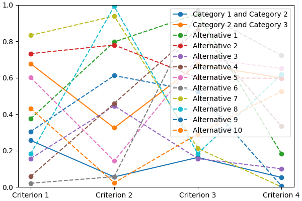

*lincs* is a collection of MCDA algorithms, usable as a C++ library, a Python package and a command-line utility.

Note that *lincs* is not licensed yet, so you don't have any rights besides reading it for now.

# Get started

## Install

First, you need to install a few dependencies:

    sudo apt-get install --yes g++ libboost-python-dev python3-dev libyaml-cpp-dev
    cd /usr/local/include
    sudo wget https://raw.githubusercontent.com/Neargye/magic_enum/v0.8.2/include/magic_enum.hpp
    sudo wget https://raw.githubusercontent.com/d99kris/rapidcsv/v8.75/src/rapidcsv.h

Finally, *lincs* is available on the [Python Package Index](https://pypi.org/project/lincs/), so `pip install lincs` should finalize the install.

Note that we *do* plan to build binary wheel distributions when the project matures to make installation easier.

## Concepts and files

*lincs* is based on the following concepts:

- a "domain" describes the objects to be classified (*a.k.a.* the "alternatives"), the criteria used to classify them, and the existing categories they can belong to;
- a "model" is used to actually assign a category to each alternative, based on the values of the criteria for that alternative;
- a "classified alternative" is an alternative, with its category.

## Start using *lincs*' command-line interface

The command-line interface is the easiest way to get started with *lincs*, starting with `lincs --help`, which should output something like:

<!-- START help/run.sh --><!--
    set -o errexit
    set -o nounset
    set -o pipefail
    trap 'echo "Error on line $LINENO"' ERR

    lincs --help >actual-help.txt
    diff expected-help.txt actual-help.txt
--><!-- STOP -->

<!-- START help/expected-help.txt -->
    Usage: lincs [OPTIONS] COMMAND [ARGS]...

      lincs (Learn and Infer Non-Compensatory Sorting) is a set of tools for
      training and using MCDA models.

    Options:
      --help  Show this message and exit.

    Commands:
      classification-accuracy  Compute a classification accuracy.
      classify                 Classify alternatives.
      generate                 Generate synthetic data.
      visualize
<!-- STOP -->

It's organized using sub-commands, the first one being `generate`, to generate synthetic pseudo-random data.

<!-- START command-line-example/run.sh --><!--
    set -o errexit
    set -o nounset
    set -o pipefail
    trap 'echo "Error on line $LINENO"' ERR

--><!-- STOP -->

Generate a classification domain with 4 criteria and 3 categories (@todo Link to concepts and file formats):

<!-- EXTEND command-line-example/run.sh -->
    lincs generate classification-domain 4 3 --output-domain domain.yml
<!-- STOP -->

The generated `domain.yml` should look like:

<!-- START command-line-example/expected-domain.yml -->
    kind: classification-domain
    format_version: 1
    criteria:
      - name: Criterion 1
        value_type: real
        category_correlation: growing
      - name: Criterion 2
        value_type: real
        category_correlation: growing
      - name: Criterion 3
        value_type: real
        category_correlation: growing
      - name: Criterion 4
        value_type: real
        category_correlation: growing
    categories:
      - name: Category 1
      - name: Category 2
      - name: Category 3
<!-- STOP -->

<!-- EXTEND command-line-example/run.sh --><!--
    diff expected-domain.yml domain.yml
--><!-- STOP -->

Then generate a classification model (@todo Link to concepts and file formats):

<!-- EXTEND command-line-example/run.sh -->
    lincs generate classification-model domain.yml --output-model model.yml
<!-- APPEND-TO-LAST-LINE --random-seed 41 -->
<!-- STOP -->

It should look like:

<!-- START command-line-example/expected-model.yml -->
    kind: classification-model
    format_version: 1
    boundaries:
      - profile:
          - 0.255905151
          - 0.0551739037
          - 0.162252158
          - 0.0526000932
        sufficient_coalitions:
          kind: weights
          criterion_weights:
            - 0.147771254
            - 0.618687689
            - 0.406786472
            - 0.0960085914
      - profile:
          - 0.676961303
          - 0.324553937
          - 0.673279881
          - 0.598555863
        sufficient_coalitions:
          kind: weights
          criterion_weights:
            - 0.147771254
            - 0.618687689
            - 0.406786472
            - 0.0960085914
<!-- STOP -->

@todo Use YAML anchors and references to avoid repeating the same sufficient coalitions in all profiles

<!-- EXTEND command-line-example/run.sh --><!--
    diff expected-model.yml model.yml
--><!-- STOP -->

You can visualize it using:

<!-- EXTEND command-line-example/run.sh -->
    lincs visualize model domain.yml model.yml model.png
<!-- STOP -->
<!-- EXTEND command-line-example/run.sh --><!--
    cp model.png ../../..
--><!-- STOP -->

It should output something like:

And finally generate a set of classified alternatives (@todo Link to concepts and file formats):

<!-- EXTEND command-line-example/run.sh -->
    lincs generate classified-alternatives domain.yml model.yml 10 --output-classified-alternatives learning-set.csv
<!-- APPEND-TO-LAST-LINE --random-seed 42 -->
<!-- STOP -->

It should look like:

<!-- START command-line-example/expected-learning-set.csv -->
    name,"Criterion 1","Criterion 2","Criterion 3","Criterion 4",category
    "Alternative 1",0.37454012,0.796543002,0.95071429,0.183434784,"Category 3"
    "Alternative 2",0.731993914,0.779690981,0.598658502,0.596850157,"Category 2"
    "Alternative 3",0.156018645,0.445832759,0.15599452,0.0999749228,"Category 1"
    "Alternative 4",0.0580836125,0.4592489,0.866176128,0.333708614,"Category 3"
    "Alternative 5",0.601114988,0.14286682,0.708072603,0.650888503,"Category 2"
    "Alternative 6",0.0205844995,0.0564115755,0.969909847,0.721998751,"Category 2"
    "Alternative 7",0.832442641,0.938552737,0.212339118,0.000778764719,"Category 2"
    "Alternative 8",0.181824967,0.99221158,0.183404505,0.61748153,"Category 2"
    "Alternative 9",0.304242253,0.611653149,0.524756432,0.00706630852,"Category 2"
    "Alternative 10",0.431945026,0.0230624285,0.291229129,0.524774671,"Category 1"
<!-- STOP -->

<!-- EXTEND command-line-example/run.sh --><!--
    diff expected-learning-set.csv learning-set.csv
--><!-- STOP -->

You can visualize it using:

<!-- EXTEND command-line-example/run.sh -->
    lincs visualize model domain.yml model.yml --alternatives learning-set.csv alternatives.png
<!-- STOP -->
<!-- EXTEND command-line-example/run.sh --><!--
    cp alternatives.png ../../..
--><!-- STOP -->

It should output something like:

@todo Improve how this graph looks:

- display categories as stacked solid colors
- display alternatives in a color that matches their assigned category
- remove the legend, place names (categories and alternatives) directly on the graph

You now have a (synthetic) learning set.
You can use it to train a new model:

<!-- EXTEND command-line-example/run.sh -->
    # @todo Use `lincs train` when it exists.
    # For now we just do:
    cp model.yml trained-model.yml
<!-- STOP -->

If the training is effective, the resulting trained model should be close to the original (synthetic) one.
To see how close a trained model is to the original one, you can reclassify a testing set.

First, generate a testing set:

<!-- EXTEND command-line-example/run.sh -->
    lincs generate classified-alternatives domain.yml model.yml 100 --output-classified-alternatives testing-set.csv
<!-- APPEND-TO-LAST-LINE --random-seed 43 -->
<!-- STOP -->

And ask the trained model to classify it:

<!-- EXTEND command-line-example/run.sh -->
    lincs classify domain.yml trained-model.yml testing-set.csv --output-classified-alternatives reclassified-testing-set.csv
<!-- STOP -->

There are a few differences between the original testing set and the reclassified one:

<!-- EXTEND command-line-example/run.sh -->
    diff testing-set.csv reclassified-testing-set.csv
<!-- APPEND-TO-LAST-LINE >classification-diff.txt || true -->
<!-- STOP -->

That command should show a few alternatives that are not classified the same way by the original and the trained model:

<!-- EXTEND command-line-example/run.sh --><!--
    diff <(true) classification-diff.txt
--><!-- STOP -->

You can also measure the classification accuracy of the trained model on that testing set:

<!-- EXTEND command-line-example/run.sh -->
    lincs classification-accuracy domain.yml trained-model.yml testing-set.csv
<!-- APPEND-TO-LAST-LINE >classification-accuracy.txt -->
<!-- STOP -->

It should be close to 100%:

<!-- START command-line-example/expected-classification-accuracy.txt -->
    100/100
<!-- STOP -->

<!-- EXTEND command-line-example/run.sh --><!--
    diff expected-classification-accuracy.txt classification-accuracy.txt
--><!-- STOP -->

Once you're comfortable with the tooling, you can use a learning set based on real-world data and train a model that you can use to classify new real-world alternatives.

# User guide

@todo Write the user guide.

# Reference

@todo Generate a reference documentation using Sphinx:
- Python using autodoc
- C++ using Doxygen+Breath
- CLI using https://sphinx-click.readthedocs.io/en/latest/
- YAML file formats using JSON Schema and https://sphinx-jsonschema.readthedocs.io/en/latest/

# Develop *lincs* itself

Run `./run-development-cycle.sh`.

<!-- Or:
    docker run --rm -it -v $PWD:/wd --workdir /wd lincs-development
After changes in C++:
    pip install --user --no-build-isolation --editable .
Then test whatever:
    lincs --help
-->
