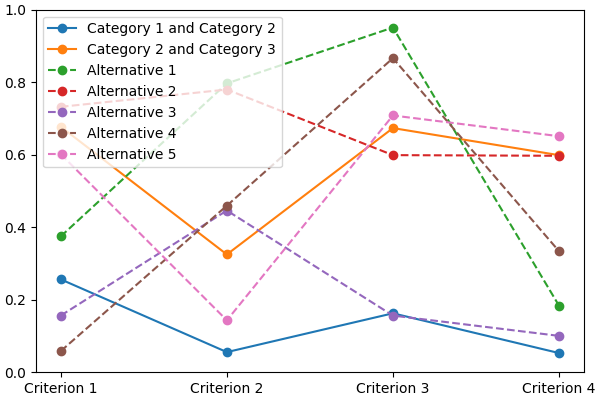

*lincs* is a collection of MCDA algorithms, usable as a C++ library, a Python package and a command-line utility.

Note that *lincs* is not licensed yet, so you don't have any rights besides reading it for now.

# Contributors and previous work

*lincs* is developed by the [MICS](https://mics.centralesupelec.fr/) research team at [CentraleSupélec](https://www.centralesupelec.fr/).

Its main authors are (alphabetical order):
- [Laurent Cabaret](http://perso.ecp.fr/~cabaretl/) (performance optimization)
- [Vincent Jacques](https://vincent-jacques.net) (engineering)
- [Vincent Mousseau](https://www.centralesupelec.fr/fr/2EBDCB86-64A4-4747-96E8-C3066CB61F3D) (domain expertise and project leadership)

It's based on work by:
- [Olivier Sobrie](http://olivier.sobrie.be/) (The "weights, profiles, breed" learning strategy for MR-Sort models, and the profiles improvement heuristic, developed in his [Ph.D thesis](http://olivier.sobrie.be/papers/phd_2016_sobrie.pdf), and [implemented in Python](https://github.com/oso/pymcda))
- Emma Dixneuf, Thibault Monsel and Thomas Vindard ([C++ implementation of Sobrie's heuristic](https://github.com/Mostah/fastPL/))

# Project goals

## Provide MCDA tools usable out of the box

You should be able to use *lincs* without being a specialist of MCDA and/or NCS models.
Just follow the [Get started](#get-started) section below.

## Provide a base for developing new MCDA algorithms

*lincs* is designed to be easy to extend with new algorithms of even replace parts of existing algorithms.
@todo Write doc about that use case.

*linc* also provides a benchmark framework to compare algorithms (@todo Write and document).
This should make it easier to understand the relative strengths and weaknesses of each algorithm.

# Get started

## Install

First, you need to install a few dependencies (@todo build binary wheel distributions to make installation easier):

<!-- START install/dependencies.sh -->
    # System packages
    sudo apt-get install --yes g++ libboost-python-dev python3-dev libyaml-cpp-dev

    # CUDA
    sudo apt-key adv --fetch-keys https://developer.download.nvidia.com/compute/cuda/repos/ubuntu2204/x86_64/3bf863cc.pub
    sudo add-apt-repository 'deb https://developer.download.nvidia.com/compute/cuda/repos/ubuntu2204/x86_64/ /'
    sudo apt-get update
    sudo apt-get install --yes cuda-cudart-dev-12-1 cuda-nvcc-12-1

    # OR-tools
    wget https://github.com/google/or-tools/releases/download/v8.2/or-tools_ubuntu-20.04_v8.2.8710.tar.gz
    tar xf or-tools_ubuntu-20.04_v8.2.8710.tar.gz
    sudo cp -r or-tools_Ubuntu-20.04-64bit_v8.2.8710/include/* /usr/local/include
    sudo cp -r or-tools_Ubuntu-20.04-64bit_v8.2.8710/lib/*.so /usr/local/lib
    sudo ldconfig
    rm -r or-tools_Ubuntu-20.04-64bit_v8.2.8710 or-tools_ubuntu-20.04_v8.2.8710.tar.gz

    # Header-only libraries
    cd /usr/local/include
    sudo wget https://raw.githubusercontent.com/Neargye/magic_enum/v0.8.2/include/magic_enum.hpp
    sudo wget https://raw.githubusercontent.com/d99kris/rapidcsv/v8.75/src/rapidcsv.h
    sudo wget https://raw.githubusercontent.com/jacquev6/lov-e-cuda/13e45bc/lov-e.hpp
    sudo wget https://raw.githubusercontent.com/doctest/doctest/v2.4.11/doctest/doctest.h
<!-- STOP -->

<!-- START install/Dockerfile-pre --><!--
    FROM ubuntu:22.04

    RUN apt-get update

    RUN DEBIAN_FRONTEND=noninteractive apt-get install --yes \
          sudo wget python3-pip dirmngr gpg-agent software-properties-common

    RUN useradd user --create-home
    RUN echo "user ALL=(ALL) NOPASSWD:ALL" > /etc/sudoers.d/user
    USER user
    ENV PATH=$PATH:/home/user/.local/bin
    WORKDIR /home/user
--><!-- STOP -->

<!-- START install/Dockerfile-post --><!--
    WORKDIR /home/user
    # Speed-up build when requirements don't change
    ADD project/requirements.txt .
    RUN pip3 install -r requirements.txt
    ADD --chown=user project /home/user/lincs
    RUN pip3 install ./lincs
--><!-- STOP -->

<!-- START install/run.sh --><!--
    set -o errexit
    set -o nounset
    set -o pipefail
    trap 'echo "Error on line $LINENO"' ERR

    # Transform the dependencies.sh file into a Dockerfile to benefit from the Docker build cache
    (
      cat Dockerfile-pre
      echo
      cat dependencies.sh \
      | grep -v -e '^#' -e '^$' \
      | sed 's/^/RUN /' \
      | sed 's/^RUN cd/WORKDIR/'
      echo
      cat Dockerfile-post
    ) >Dockerfile

    mkdir project
    cp -r ../../../{lincs,requirements.txt,setup.py} project
    touch project/README.md  # No need for the actual readme, so don't bust the Docker cache

    docker build . --tag lincs-development--install --quiet >/dev/null
    docker run --rm lincs-development--install lincs --help >/dev/null
--><!-- STOP -->

Finally, *lincs* is available on the [Python Package Index](https://pypi.org/project/lincs/), so `pip install lincs` should finalize the install.

## Concepts and files

*lincs* is based on the following concepts:

- a "domain" describes the objects to be classified (*a.k.a.* the "alternatives"), the criteria used to classify them, and the existing categories they can belong to;
- a "model" is used to actually assign a category to each alternative, based on the values of the criteria for that alternative;
- a "classified alternative" is an alternative, with its category.

## Start using *lincs*' command-line interface

The command-line interface is the easiest way to get started with *lincs*, starting with `lincs --help`, which should output something like:

<!-- START help/run.sh --><!--
    set -o errexit
    set -o nounset
    set -o pipefail
    trap 'echo "Error on line $LINENO"' ERR

    lincs --help >actual-help.txt
    diff expected-help.txt actual-help.txt
--><!-- STOP -->

<!-- START help/expected-help.txt -->
    Usage: lincs [OPTIONS] COMMAND [ARGS]...

      lincs (Learn and Infer Non-Compensatory Sorting) is a set of tools for
      training and using MCDA models.

    Options:
      --help  Show this message and exit.

    Commands:
      classification-accuracy  Compute a classification accuracy.
      classify                 Classify alternatives.
      generate                 Generate synthetic data.
      learn                    Learn a model.
      visualize                Make graphs from data.
<!-- STOP -->

It's organized using sub-commands, the first one being `generate`, to generate synthetic pseudo-random data.

<!-- START command-line-example/run.sh --><!--
    set -o errexit
    set -o nounset
    set -o pipefail
    trap 'echo "Error on line $LINENO"' ERR

--><!-- STOP -->

Generate a classification domain with 4 criteria and 3 categories (@todo Link to concepts and file formats):

<!-- EXTEND command-line-example/run.sh -->
    lincs generate classification-domain 4 3 --output-domain domain.yml
<!-- APPEND-TO-LAST-LINE --random-seed 40 -->
<!-- STOP -->

The generated `domain.yml` should look like:

<!-- START command-line-example/expected-domain.yml -->
    kind: classification-domain
    format_version: 1
    criteria:
      - name: Criterion 1
        value_type: real
        category_correlation: growing
      - name: Criterion 2
        value_type: real
        category_correlation: growing
      - name: Criterion 3
        value_type: real
        category_correlation: growing
      - name: Criterion 4
        value_type: real
        category_correlation: growing
    categories:
      - name: Category 1
      - name: Category 2
      - name: Category 3
<!-- STOP -->

<!-- EXTEND command-line-example/run.sh --><!--
    diff expected-domain.yml domain.yml
--><!-- STOP -->

Then generate a classification model (@todo Link to concepts and file formats):

<!-- EXTEND command-line-example/run.sh -->
    lincs generate classification-model domain.yml --output-model model.yml
<!-- APPEND-TO-LAST-LINE --random-seed 41 -->
<!-- STOP -->

It should look like:

<!-- START command-line-example/expected-model.yml -->
    kind: classification-model
    format_version: 1
    boundaries:
      - profile:
          - 0.255905151
          - 0.0551739037
          - 0.162252158
          - 0.0526000932
        sufficient_coalitions:
          kind: weights
          criterion_weights:
            - 0.147771254
            - 0.618687689
            - 0.406786472
            - 0.0960085914
      - profile:
          - 0.676961303
          - 0.324553937
          - 0.673279881
          - 0.598555863
        sufficient_coalitions:
          kind: weights
          criterion_weights:
            - 0.147771254
            - 0.618687689
            - 0.406786472
            - 0.0960085914
<!-- STOP -->

@todo Use YAML anchors and references to avoid repeating the same sufficient coalitions in all profiles

<!-- EXTEND command-line-example/run.sh --><!--
    diff expected-model.yml model.yml
--><!-- STOP -->

You can visualize it using:

<!-- EXTEND command-line-example/run.sh -->
    lincs visualize classification-model domain.yml model.yml model.png
<!-- STOP -->
<!-- EXTEND command-line-example/run.sh --><!--
    cp model.png ../../..
--><!-- STOP -->

It should output something like:

And finally generate a set of classified alternatives (@todo Link to concepts and file formats):

<!-- EXTEND command-line-example/run.sh -->
    lincs generate classified-alternatives domain.yml model.yml 1000 --output-classified-alternatives learning-set.csv
<!-- APPEND-TO-LAST-LINE --random-seed 42 -->
<!-- STOP -->

It should start with something like this, and contain 1000 alternatives:

<!-- START command-line-example/expected-learning-set.csv -->
    name,"Criterion 1","Criterion 2","Criterion 3","Criterion 4",category
    "Alternative 1",0.37454012,0.796543002,0.95071429,0.183434784,"Category 3"
    "Alternative 2",0.731993914,0.779690981,0.598658502,0.596850157,"Category 2"
    "Alternative 3",0.156018645,0.445832759,0.15599452,0.0999749228,"Category 1"
    "Alternative 4",0.0580836125,0.4592489,0.866176128,0.333708614,"Category 3"
    "Alternative 5",0.601114988,0.14286682,0.708072603,0.650888503,"Category 2"
<!-- STOP -->

<!-- EXTEND command-line-example/run.sh --><!--
    diff expected-learning-set.csv <(head -n 6 learning-set.csv)
--><!-- STOP -->

You can visualize its first five alternatives using:

<!-- EXTEND command-line-example/run.sh -->
    lincs visualize classification-model domain.yml model.yml --alternatives learning-set.csv --alternatives-count 5 alternatives.png
<!-- STOP -->
<!-- EXTEND command-line-example/run.sh --><!--
    cp alternatives.png ../../..
--><!-- STOP -->

It should output something like:

@todo Improve how this graph looks:

- display categories as stacked solid colors
- display alternatives in a color that matches their assigned category
- remove the legend, place names (categories and alternatives) directly on the graph

You now have a (synthetic) learning set.
You can use it to train a new model:

<!-- EXTEND command-line-example/run.sh -->
    # @todo Rename the command to `train`?
    lincs learn classification-model domain.yml learning-set.csv --output-model trained-model.yml
<!-- APPEND-TO-LAST-LINE --mrsort.weights-profiles-breed.accuracy-heuristic.random-seed 43 -->
<!-- STOP -->

The trained model has the same structure as the original (synthetic) model because they are both MR-Sort models for the same domain,
but the trained model is numerically different because information was lost in the process:

<!-- START command-line-example/expected-trained-model.yml -->
    kind: classification-model
    format_version: 1
    boundaries:
      - profile:
          - 0.00751833664
          - 0.0549556538
          - 0.162616938
          - 0.193127945
        sufficient_coalitions:
          kind: weights
          criterion_weights:
            - 0.499998987
            - 0.5
            - 0.5
            - 0
      - profile:
          - 0.0340298451
          - 0.324480206
          - 0.672487617
          - 0.427051842
        sufficient_coalitions:
          kind: weights
          criterion_weights:
            - 0.499998987
            - 0.5
            - 0.5
            - 0
<!-- STOP -->

<!-- EXTEND command-line-example/run.sh --><!--
    diff expected-trained-model.yml trained-model.yml
--><!-- STOP -->

If the training is effective, the resulting trained model should behave closely to the original one.
To see how close a trained model is to the original one, you can reclassify a testing set.

First, generate a testing set:

<!-- EXTEND command-line-example/run.sh -->
    lincs generate classified-alternatives domain.yml model.yml 10000 --output-classified-alternatives testing-set.csv
<!-- APPEND-TO-LAST-LINE --random-seed 44 -->
<!-- STOP -->

And ask the trained model to classify it:

<!-- EXTEND command-line-example/run.sh -->
    lincs classify domain.yml trained-model.yml testing-set.csv --output-classified-alternatives reclassified-testing-set.csv
<!-- STOP -->

There are a few differences between the original testing set and the reclassified one:

<!-- EXTEND command-line-example/run.sh -->
    diff testing-set.csv reclassified-testing-set.csv
<!-- APPEND-TO-LAST-LINE >classification-diff.txt || true -->
<!-- STOP -->

That command should show a few alternatives that are not classified the same way by the original and the trained model:

<!-- START command-line-example/expected-classification-diff.txt -->
    2595c2595
    < "Alternative 2594",0.234433308,0.780464768,0.162389532,0.622178912,"Category 2"
    ---
    > "Alternative 2594",0.234433308,0.780464768,0.162389532,0.622178912,"Category 1"
    5000c5000
    < "Alternative 4999",0.074135974,0.496049821,0.672853291,0.782560945,"Category 2"
    ---
    > "Alternative 4999",0.074135974,0.496049821,0.672853291,0.782560945,"Category 3"
    5346c5346
    < "Alternative 5345",0.815349102,0.580399215,0.162403136,0.995580792,"Category 2"
    ---
    > "Alternative 5345",0.815349102,0.580399215,0.162403136,0.995580792,"Category 1"
    9639c9639
    < "Alternative 9638",0.939305425,0.0550933145,0.247014269,0.265170485,"Category 1"
    ---
    > "Alternative 9638",0.939305425,0.0550933145,0.247014269,0.265170485,"Category 2"
    9689c9689
    < "Alternative 9688",0.940304875,0.885046899,0.162586793,0.515185535,"Category 2"
    ---
    > "Alternative 9688",0.940304875,0.885046899,0.162586793,0.515185535,"Category 1"
    9934c9934
    < "Alternative 9933",0.705289483,0.11529737,0.162508503,0.0438248962,"Category 2"
    ---
    > "Alternative 9933",0.705289483,0.11529737,0.162508503,0.0438248962,"Category 1"
<!-- STOP -->

<!-- EXTEND command-line-example/run.sh --><!--
    diff expected-classification-diff.txt classification-diff.txt
--><!-- STOP -->

You can also measure the classification accuracy of the trained model on that testing set:

<!-- EXTEND command-line-example/run.sh -->
    lincs classification-accuracy domain.yml trained-model.yml testing-set.csv
<!-- APPEND-TO-LAST-LINE >classification-accuracy.txt -->
<!-- STOP -->

It should be close to 100%:

<!-- START command-line-example/expected-classification-accuracy.txt -->
    9994/10000
<!-- STOP -->

<!-- EXTEND command-line-example/run.sh --><!--
    diff expected-classification-accuracy.txt classification-accuracy.txt
--><!-- STOP -->

Once you're comfortable with the tooling, you can use a learning set based on real-world data and train a model that you can use to classify new real-world alternatives.

# User guide

@todo Write the user guide.

# Reference

@todo Generate a reference documentation using Sphinx:
- Python using autodoc
- C++ using Doxygen+Breath
- CLI using https://sphinx-click.readthedocs.io/en/latest/
- YAML file formats using JSON Schema and https://sphinx-jsonschema.readthedocs.io/en/latest/

# Develop *lincs* itself

Run `./run-development-cycle.sh`.

<!-- Or:
    docker run --rm -it -v $PWD:/wd --workdir /wd lincs-development
After changes in C++:
    pip install --user --no-build-isolation --editable .
Then test whatever:
    lincs --help
-->
