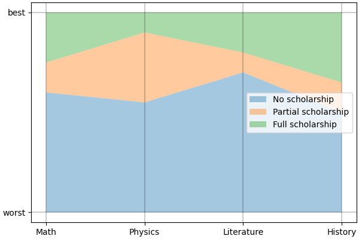

.. Copyright 2023 Vincent Jacques

===================
Conceptual overview
===================

@todo Double-check strictness of inequalities (:math:`\lt` *vs.* :math:`\le`) and inclusions (:math:`\subset` *vs.* :math:`\subseteq`) in all formal definitions in this document

About classification
====================

For now, *lincs* focuses on "classification" problems, *i.e.* the task of sorting "alternatives" into "categories".
Categories are ordered: there is a worst category and a best category, and possibly some intermediates.
Alternatives are assigned to a category based on their "performances" on a set of "criteria".
The description of the criteria and categories constitutes the "problem" itself.

This vocabulary is voluntarily abstract to allow for a wide range of applications, so a concrete example might help.
Let's say you want to assign scholarships to students based on their academic performances.
Your funding policy might be that students with the best grades should get the best scholarships.
And you might want to favor younger students, and/or students coming from more modest backgrounds.
In this example, the categories are the different scholarships, the alternatives are the students,
and the criteria are grades on each topic, age and family income.
For a given student, their performances are their actual grades on each topic, their age and their family income.

The same vocabulary could apply to triaging patients in an hospital based on vital signs.

.. admonition:: Formal definition

  A problem is defined by:

  - its number of criteria :math:`n \in \mathbb{N}`
  - its set of criteria :math:`\{X_i\}_{i \in \{1, ..., n\}}`. Each criterion is a set of values :math:`X_i` with a total pre-order :math:`\preccurlyeq_i`, for :math:`i \in \{1, ..., n\}`
  - its number of categories :math:`p \in \mathbb{N}`
  - its set of categories :math:`C = \{C^h\}_{h \in \{1, ..., p\}}`, ordered by :math:`C^1 \prec ... \prec C^p`

  In that setting, alternatives are the Cartesian product of the criteria: :math:`X = \prod_{i \in \{1, ..., n\}} X_i`.
  For a given alternative :math:`x = (x_1, ..., x_n) \in X`, its performance on criterion :math:`i` is :math:`x_i \in X_i`.

*lincs* stores and reads information about the classification problem using :ref:`the YAML problem file format <ref-file-problem>`.
Alternatives are stored and read using :ref:`the CSV alternatives file format <ref-file-alternatives>`.

Learning and classifying
========================

*lincs* provides algorithms to automate the classification of alternatives into categories.
Its approach is to first "learn" a "model" from a set of already classified alternatives, and then use that model to classify new alternatives.
The set of pre-classified alternatives is called the "training set"; it constitutes the ground truth for the learning phase.

Formally, models are functions from alternatives to categories: :math:`f: X \rightarrow C`.

Most models are parametric functions of a given form, and the learning phase consists in finding the parameters that best fit the training set.

Non-compensatory sorting (NCS)
==============================

In general, we expect alternatives with higher performances to be assigned to better categories.
But sometimes, there are some criteria that are so important that they can't be compensated by other criteria.
Non-compensatory sorting models are a way to capture that idea.

There are many "families" of models, *i.e.* sets of models that share the same general parametric form with varying parameters.
NCS models are one such family.

An NCS model defines a "lower performance profile" for each category.
It then assigns an alternative to a good category if that alternative has performances above that category's lower profiles on a sufficient set of the criteria.
Sets of criteria are called "coalitions".
NCS models allow for several ways to reach the minimum performance level to be assigned to a category,
so sufficient criteria for a category are not a *single* coalition, but actually a *set* of coalitions.
Additionally, this set of coalitions can be different for each category.

.. admonition:: Formal definition

  For a given set :math:`S` , we note :math:`\mathcal{P}(S)` the set of all subsets of :math:`S` (*a.k.a.* its power set).

  An NCS model :math:`f: X \rightarrow \{1, ..., p\}` is a parametric function from :math:`X` to :math:`\{1, ..., p\}` defined by the following parameters:

  - for each category but the first, *i.e.* for :math:`C^h` for :math:`h \in \{2, ..., p\}`:

    - its lower performance profile :math:`b^h = (b^h_1, ..., b^h_n) \in X` (do not confuse :math:`h` for an exponent; it's just an index)
    - its sufficient coalitions :math:`\mathcal{F}^h \subseteq \mathcal{P}(\{1, ..., n\})`

  With the following constraints:

  - the profiles must be ordered: :math:`b^h_i \preccurlyeq_i b^{h + 1}_i` for each category :math:`h \in \{2, ..., p - 1\}` and each criterion :math:`i \in \{1, ..., n\}`
  - each category's set of sufficient coalitions :math:`\mathcal{F}^h` must be up-closed by inclusion: if :math:`S \in \mathcal{F}^h` and :math:`S \subset T \in \mathcal{P}(\{1, ..., n\})`, then :math:`T \in \mathcal{F}^h`
  - sufficient coalitions must be imbricated: :math:`\mathcal{F}^2 \supseteq ... \supseteq \mathcal{F}^p`

  This NCS model assigns an alternative :math:`x = (x_1, ..., x_n) \in X` to the best category :math:`C^h`
  such that the criteria on which :math:`x` has performances above that category's lower profile are sufficient,
  defaulting to the worst category (:math:`C^1`):

  .. math::

    f: x \mapsto C^\max (\{1\} \cup \{ h \in \{2, ..., p\}: \{ i \in \{1, ..., n\}: x_i \succcurlyeq_i b^h_i \} \in \mathcal{F}^h \})

This definition may differ slightly from the one you're used to, but it should be formally equivalent.
We use it in *lincs* because it is somewhat simple and matches the implementation quite well.
We detail its equivalence to other common definitions in the following appendix:
@todo Write appendix about equivalence of definitions (:math:`h` is shifted by 1, assignment to category is a max instead of two conditions)

The constraints in the definition all ensure NDS models behave according to intuition:

- the ordering of profiles ensures consistency with the order on categories
- the up-closed-ness-by-inclusion(!) of the sufficient coalitions matches the intuition that they are *sufficient* criteria: if a few criteria are sufficient, then more criteria are still sufficient
- the imbrication of sufficient coalitions matches the intuition that upper categories are more selective than lower ones

NCS classification models are stored and read using :ref:`the YAML NCS model file format <ref-file-ncs-model>`.

Example
-------

Let's continue on the scholarship example.
Let's say there a three levels: "no scholarship" (:math:`C^1`), "partial scholarship" (:math:`C^2`) and "full scholarship" (:math:`C^3`).
To further simplify things without sacrificing the interest of the example, we can consider four criteria:
grades in math (:math:`M`), physics (:math:`P`), literature (:math:`L`) and history (:math:`H`), all normalized to be between 0 and 1,
and forget about age and family income for now.

For clarity, we'll use :math:`M`, :math:`P`, :math:`L` and :math:`H` as lower indexes instead of :math:`i` for criteria.
Grades have the form :math:`x = (x_M, x_P, x_L, x_H) \in X`.

Let's consider the following NCS model:

- :math:`b^2 = (b^2_M, b^2_P, b^2_L, b^2_H) = (0.6, 0.55, 0.7, 0.5)`
- :math:`\mathcal{F}^2 = \{ \{M, L\}, \{M, H\}, \{P, L\}, \{P, H\}, \{M, P, L\}, \{M, P, H\}, \{M, L, H\}, \{P, L, H\}, \{M, P, L, H\} \}`
- :math:`b^3 = (b^3_M, b^3_P, b^3_L, b^3_H) = (0.75, 0.9, 0.8, 0.65)`
- :math:`\mathcal{F}^3 = \{ \{M, P, L\}, \{M, P, H\}, \{M, L, H\}, \{P, L, H\}, \{M, P, L, H\} \}`

You can check that the constraints of NCS models are satisfied:

- :math:`b^2_i \preccurlyeq_i b^3_i` for :math:`i \in \{M, P, L, H\}`
- :math:`\mathcal{F}^2` and :math:`\mathcal{F}^3` are up-closed by inclusion
- :math:`\mathcal{F}^2 \supseteq \mathcal{F}^3`

The profiles for this model look like this:

.. START concept-example/run.sh
    set -o errexit
    set -o nounset
    set -o pipefail
    trap 'echo "Error on line $LINENO"' ERR

    lincs visualize classification-model problem.yml model.yml concept-example-model.png
    cp concept-example-model.png ../../../doc-sources
.. STOP

.. START concept-example/problem.yml
    kind: classification-problem
    format_version: 1
    criteria:
      - name: Math
        value_type: real
        category_correlation: growing
      - name: Physics
        value_type: real
        category_correlation: growing
      - name: Literature
        value_type: real
        category_correlation: growing
      - name: History
        value_type: real
        category_correlation: growing
    categories:
      - name: No scholarship
      - name: Partial scholarship
      - name: Full scholarship
.. STOP

.. START concept-example/model.yml
    kind: calssification-model
    format_version: 1
    boundaries:
      - profile: [0.6, 0.55, 0.7, 0.5]
        sufficient_coalitions:
          kind: weights  # @todo Use upset_roots when it's implemented
          criterion_weights: [0.5, 0.5, 0.5, 0.5]  # NOT Equivalent to F^2 because F^2 cannot be MR-Sort
      - profile: [0.75, 0.9, 0.8, 0.65]
        sufficient_coalitions:
          kind: weights  # @todo Use upset_roots when it's implemented
          criterion_weights: [0.35, 0.35, 0.35, 0.35]  # Equivalent to F^3
.. STOP

The sufficient coalitions for "partial scholarship" (*i.e.* :math:`\mathcal{F}^2`) can be represented by:

.. graphviz::

    digraph G {
      node [shape=box,color="red",fontcolor="red"];
      edge [color="red"];
      rankdir=BT;
      empty -> M [color="grey"];
      empty -> P [color="grey"];
      empty -> L [color="grey"];
      empty -> H [color="grey"];
      M -> MP [color="grey"];
      P -> MP [color="grey"];
      M -> ML [color="grey"];
      L -> ML [color="grey"];
      M -> MH [color="grey"];
      H -> MH [color="grey"];
      P -> PL [color="grey"];
      L -> PL [color="grey"];
      P -> PH [color="grey"];
      H -> PH [color="grey"];
      L -> LH [color="grey"];
      H -> LH [color="grey"];
      MP -> MPL [color="grey"];
      MP -> MPH [color="grey"];
      ML -> MPL [color="black"];
      ML -> MLH [color="black"];
      MH -> MPH [color="black"];
      MH -> MLH [color="black"];
      PL -> MPL [color="black"];
      PL -> PLH [color="black"];
      PH -> MPH [color="black"];
      PH -> PLH [color="black"];
      LH -> MLH [color="grey"];
      LH -> PLH [color="grey"];
      MPL -> MPLH [color="black"];
      MPH -> MPLH [color="black"];
      MLH -> MPLH [color="black"];
      PLH -> MPLH [color="black"];

      empty [label=<{}>,color="grey",fontcolor="grey"];
      M [label=<{<i>M</i>}>,color="grey",fontcolor="grey"];
      P [label=<{<i>P</i>}>,color="grey",fontcolor="grey"];
      L [label=<{<i>L</i>}>,color="grey",fontcolor="grey"];
      H [label=<{<i>H</i>}>,color="grey",fontcolor="grey"];
      MP [label=<{<i>M</i>, <i>P</i>}>,color="grey",fontcolor="grey"];
      ML [label=<{<i>M</i>, <i>L</i>}>,color="black",fontcolor="black"];
      MH [label=<{<i>M</i>, <i>H</i>}>,color="black",fontcolor="black"];
      PL [label=<{<i>P</i>, <i>L</i>}>,color="black",fontcolor="black"];
      PH [label=<{<i>P</i>, <i>H</i>}>,color="black",fontcolor="black"];
      LH [label=<{<i>L</i>, <i>H</i>}>,color="grey",fontcolor="grey"];
      MPL [label=<{<i>M</i>, <i>P</i>, <i>L</i>}>,color="black",fontcolor="black"];
      MPH [label=<{<i>M</i>, <i>P</i>, <i>H</i>}>,color="black",fontcolor="black"];
      MLH [label=<{<i>M</i>, <i>L</i>, <i>H</i>}>,color="black",fontcolor="black"];
      PLH [label=<{<i>P</i>, <i>L</i>, <i>H</i>}>,color="black",fontcolor="black"];
      MPLH [label=<{<i>M</i>, <i>P</i>, <i>L</i>, <i>H</i>}>,color="black",fontcolor="black"];
    }

:math:`\mathcal{P}({\{M, P, L, H\}})` is represented as a lattice where arrows materialize the inclusion relationship (:math:`\subset`).
Elements of :math:`\mathcal{F}^2` are black and others are grey.

And here are the sufficient coalitions for "full scholarship" (*i.e.* :math:`\mathcal{F}^3`):

.. graphviz::

    digraph G {
      node [shape=box,color="red",fontcolor="red"];
      edge [color="red"];
      rankdir=BT;
      empty -> M [color="grey"];
      empty -> P [color="grey"];
      empty -> L [color="grey"];
      empty -> H [color="grey"];
      M -> MP [color="grey"];
      P -> MP [color="grey"];
      M -> ML [color="grey"];
      L -> ML [color="grey"];
      M -> MH [color="grey"];
      H -> MH [color="grey"];
      P -> PL [color="grey"];
      L -> PL [color="grey"];
      P -> PH [color="grey"];
      H -> PH [color="grey"];
      L -> LH [color="grey"];
      H -> LH [color="grey"];
      MP -> MPL [color="grey"];
      MP -> MPH [color="grey"];
      ML -> MPL [color="grey"];
      ML -> MLH [color="grey"];
      MH -> MPH [color="grey"];
      MH -> MLH [color="grey"];
      PL -> MPL [color="grey"];
      PL -> PLH [color="grey"];
      PH -> MPH [color="grey"];
      PH -> PLH [color="grey"];
      LH -> MLH [color="grey"];
      LH -> PLH [color="grey"];
      MPL -> MPLH [color="black"];
      MPH -> MPLH [color="black"];
      MLH -> MPLH [color="black"];
      PLH -> MPLH [color="black"];

      empty [label=<{}>,color="grey",fontcolor="grey"];
      M [label=<{<i>M</i>}>,color="grey",fontcolor="grey"];
      P [label=<{<i>P</i>}>,color="grey",fontcolor="grey"];
      L [label=<{<i>L</i>}>,color="grey",fontcolor="grey"];
      H [label=<{<i>H</i>}>,color="grey",fontcolor="grey"];
      MP [label=<{<i>M</i>, <i>P</i>}>,color="grey",fontcolor="grey"];
      ML [label=<{<i>M</i>, <i>L</i>}>,color="grey",fontcolor="grey"];
      MH [label=<{<i>M</i>, <i>H</i>}>,color="grey",fontcolor="grey"];
      PL [label=<{<i>P</i>, <i>L</i>}>,color="grey",fontcolor="grey"];
      PH [label=<{<i>P</i>, <i>H</i>}>,color="grey",fontcolor="grey"];
      LH [label=<{<i>L</i>, <i>H</i>}>,color="grey",fontcolor="grey"];
      MPL [label=<{<i>M</i>, <i>P</i>, <i>L</i>}>,color="black",fontcolor="black"];
      MPH [label=<{<i>M</i>, <i>P</i>, <i>H</i>}>,color="black",fontcolor="black"];
      MLH [label=<{<i>M</i>, <i>L</i>, <i>H</i>}>,color="black",fontcolor="black"];
      PLH [label=<{<i>P</i>, <i>L</i>, <i>H</i>}>,color="black",fontcolor="black"];
      MPLH [label=<{<i>M</i>, <i>P</i>, <i>L</i>, <i>H</i>}>,color="black",fontcolor="black"];
    }

We can now attribute scholarships to a few students according to this model.
We first look for the set of criteria where they get grades above :math:`b^2`.
If this set is in :math:`\mathcal{F}^2`, then they could get a partial scholarship.
We then check if the set of criteria where they get grades above :math:`b^3` is in :math:`\mathcal{F}^3`.
If yes, they get a full scholarship.

.. @todo When upset_roots is implemented: use ``lincs classify`` to check this table.

=======   ============================================   ======================   ========================   ======================   ========================   ===========
Student   Grades                                         Above :math:`b^2`        In :math:`\mathcal{F}^2`   Above :math:`b^3`        In :math:`\mathcal{F}^3`   Scholarship
=======   ============================================   ======================   ========================   ======================   ========================   ===========
A         :math:`(1, 1, 1, 1)`                           :math:`\{M, P, L, H\}`   Yes                        :math:`\{M, P, L, H\}`   Yes                        Full
B         :math:`(1, 1, 1, 0)`                           :math:`\{M, P, L\}`      Yes                        :math:`\{M, P, L\}`      Yes                        Full
C         :math:`(0.8, 0.7, 0.85, 0.6)`                  :math:`\{M, P, L, H\}`   Yes                        :math:`\{M, L\}`         No                         Partial
D         :math:`(1, 0, 1, 0)`                           :math:`\{M, L\}`         Yes                        :math:`\{M, L\}`         No                         Partial
E         :math:`(1, 1, 0, 0)`                           :math:`\{M, P\}`         No                         :math:`\{M, P\}`         No                         None
=======   ============================================   ======================   ========================   ======================   ========================   ===========

In prose, this model can be formulated as follows:

- students who have excellent grades (above :math:`b^3`) in at least three subjects get a full scholarship
- students who have good grades (above :math:`b^2`) in at least one scientific subject (:math:`M` and :math:`P`) and at least one literary subject  (:math:`L` and :math:`H`) get a partial scholarship
- other students get no scholarship

Particular cases
----------------

Some particular cases are quite common.
They are NCS models with additional constraints, so they are slightly less general, but sufficient in many cases and computationally simpler to learn.

Here are a few that are used in *lincs*:

:math:`U^c \textsf{-} NCS`
~~~~~~~~~~~~~~~~~~~~~~~~~~

A :math:`U^c \textsf{-} NCS` model is an NCS model where all :math:`\mathcal{F}^h` are the same.
This simplification captures the idea that in many cases, the same criteria are sufficient for all categories, and that categories are mostly defined by their lower performance profile.

.. admonition:: Formal definition

    A :math:`U^c \textsf{-} NCS` model is an NCS model with the following additional constraint:

    - there is a single :math:`\mathcal{F} \subseteq \mathcal{P}(\{1, ..., n\})` such that :math:`\mathcal{F}^h = \mathcal{F}` for each category :math:`h \in \{2, ..., p\}`

In the previous model example, :math:`\mathcal{F}^2 \ne \mathcal{F}^3`, so it is not a :math:`U^c \textsf{-} NCS` model.

:math:`1 \textsf{-} U^c \textsf{-} NCS` *a.k.a.* MR-Sort
~~~~~~~~~~~~~~~~~~~~~~~~~~~~~~~~~~~~~~~~~~~~~~~~~~~~~~~~

An MR-Sort model is a :math:`U^c \textsf{-} NCS` model with the additional simplification that :math:`\mathcal{F}` is defined using weights on criteria and a threshold.
A coalition is sufficient if the sum of the weights of its criteria is above 1.

.. admonition:: Formal definition

  An MR-Sort model is a :math:`U^c \textsf{-} NCS` model with the following additional parameters:

  - for each criterion :math:`i \in \{1, ..., n\}`:

    - its weight :math:`w_i \in [0, 1]`

  and the following additional constraint:

  - :math:`\mathcal{F} = \{ S \in \mathcal{P}(\{1, ..., n\}): \sum_{i \in S} w_i \geq 1 \}`

Again, this definition differs slightly from others in the literature.
We detail their equivalence in this appendix:
@todo Write appendix about equivalence of definitions (weights are de-normalized, :math:`\lambda` is 1)

Example
.......

Let's consider a simplified form of our previous model example, with only the two categories :math:`C^1` and :math:`C^2`,
and the same profile :math:`b^2` and sufficient coalitions :math:`\mathcal{F}^2` as before.
Is it an MR-Sort model?
To answer this question, we can try to find weights :math:`w_M`, :math:`w_P`, :math:`w_L`, :math:`w_H` such that
:math:`\mathcal{F}^2 = \{ S \in \mathcal{P}(\{M, P, L, H\}): \sum_{i \in S} w_i \geq 1 \}`.
This gives us :math:`|\mathcal{P}(\{M, P, L, H\})| = 16` equations, amongst which the following 6 are of interest:

- :math:`w_M + w_P \lt 1` (because :math:`\{M, P\} \notin \mathcal{F}^2`)
- :math:`w_L + w_H \lt 1` (because :math:`\{L, H\} \notin \mathcal{F}^2`)
- :math:`w_M + w_L \ge 1` (because :math:`\{M, L\} \in \mathcal{F}^2`)
- :math:`w_P + w_L \ge 1` (because :math:`\{P, L\} \in \mathcal{F}^2`)
- :math:`w_M + w_H \ge 1` (because :math:`\{M, H\} \in \mathcal{F}^2`)
- :math:`w_P + w_H \ge 1` (because :math:`\{P, H\} \in \mathcal{F}^2`)

Summing the first two equations gives :math:`w_M + w_P + w_L + w_H \lt 2`, and summing teh last four gives :math:`w_M + w_P + w_L + w_H \ge 2`,
so there is no solution, and that model is not MR-Sort.

By contrast, the coalitions :math:`\mathcal{F}^3` of the previous model example can be expressed using the following weights:
:math:`w_M = 0.4`, :math:`w_P = 0.4`, :math:`w_L = 0.4`, :math:`w_H = 0.4`: coalitions of at most two criteria have weights sums less than 1,
and coalitions of at least 3 criteria have weights sums greater than 1.

Intuitively, MR-Sort models can express slightly fewer differences in the importance of criteria than :math:`U^c \textsf{-} NCS` models.

Synthetic data
==============

It's not always practical to use real-world data when developing a new learning algorithm, so one can use synthetic data instead.
In that approach, one specifies the problem and provides a pre-known model.
They then generate pseudo-random alternatives classified according to that original model,
and use them as a training set to learn a new model.
Finally, they compare how close the learned model behaves to the original one to evaluate the quality of the algorithm.

*lincs* provides ways to generate synthetic pseudo-random problems, models and training sets.
The same file formats are used for synthetic and real-world data.

Next
====

If you haven't done so yet, we recommend you now follow our :doc:`"Get started" guide <get-started>`.
