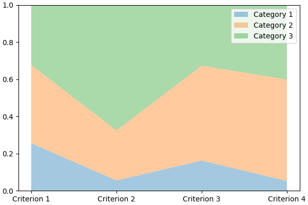
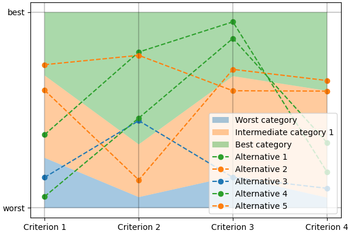

.. Copyright 2023 Vincent Jacques

===========
Get started
===========

Get *lincs*
===========

We provide binary wheels for *lincs* on Linux, Windows and macOS for x86_64 processors,
so running ``pip install lincs --only-binary lincs`` should be enough on those systems.

If you're on a platform for which we don't make wheels, you'll need to build *lincs* from sources.
We don't recommend you do that, because it can be a lot of work.
If you really want to go that route, you may want to start by reading the `GitHub Actions workflow <https://github.com/MICS-Lab/lincs/blob/main/.github/workflows/distribute.yml>`_ we use to build the binary wheels.
You'll probably start by trying ``pip install lincs``, see what dependencies are missing, install them and iterate from there.
If you end up modifying *lincs* to make it work on your platform, we kindly ask you to contribute your changes back to the project.

.. _start-command-line:

Start using *lincs*' command-line interface
===========================================

.. START help/run.sh
    set -o errexit
    set -o nounset
    set -o pipefail
    trap 'echo "Error on line $LINENO"' ERR

    lincs --help >actual-help.txt
    diff expected-help.txt actual-help.txt
.. STOP

.. START help/expected-help.txt

.. highlight:: text

The command-line interface is the easiest way to get started with *lincs*, starting with ``lincs --help``, which should output something like::

    Usage: lincs [OPTIONS] COMMAND [ARGS]...

      lincs (Learn and Infer Non-Compensatory Sorting) is a set of tools for
      training and using MCDA models.

    Options:
      --version  Show the version and exit.
      --help     Show this message and exit.

    Commands:
      classification-accuracy  Compute a classification accuracy.
      classify                 Classify alternatives.
      generate                 Generate synthetic data.
      info                     Get information about lincs itself.
      learn                    Learn a model.
      visualize                Make graphs from data.

.. STOP

It's organized into sub-commands, the first one being ``generate``, to generate synthetic pseudo-random data.

*lincs* is designed to handle real-world data, but it's often easier to start with synthetic data to get familiar with the tooling and required file formats.
Synthetic data is described in our :ref:`conceptual overview documentation <overview-synthetic-data>`.

.. START command-line-example/run.sh
    set -o errexit
    set -o nounset
    set -o pipefail
    trap 'echo "Error on line $LINENO"' ERR
.. STOP

.. highlight:: shell

.. EXTEND command-line-example/run.sh

So, start by generating a classification problem with 4 criteria and 3 categories::

    lincs generate classification-problem 4 3 --output-problem problem.yml

.. APPEND-TO-LAST-LINE --random-seed 40
.. STOP

.. highlight:: yaml

.. START command-line-example/expected-problem.yml

The generated ``problem.yml`` should look like::

    # Reproduction command (with lincs version 0.9.1): lincs generate classification-problem 4 3 --random-seed 40
    kind: classification-problem
    format_version: 1
    criteria:
      - name: Criterion 1
        value_type: real
        category_correlation: growing
        min_value: 0
        max_value: 1
      - name: Criterion 2
        value_type: real
        category_correlation: growing
        min_value: 0
        max_value: 1
      - name: Criterion 3
        value_type: real
        category_correlation: growing
        min_value: 0
        max_value: 1
      - name: Criterion 4
        value_type: real
        category_correlation: growing
        min_value: 0
        max_value: 1
    categories:
      - name: Category 1
      - name: Category 2
      - name: Category 3

.. STOP

You can edit this file to change the criteria names, the number of categories, *etc.* as long as you keep the same format.
That format is documented in our :ref:`reference documentation <ref-file-problem>`.
The concept of "classification problem" is described in our :ref:`conceptual overview documentation <overview-about-classification>`.

.. EXTEND command-line-example/run.sh
    diff expected-problem.yml problem.yml
.. STOP

.. highlight:: shell

.. EXTEND command-line-example/run.sh

Then generate an NCS classification model::

    lincs generate classification-model problem.yml --output-model model.yml

.. APPEND-TO-LAST-LINE --random-seed 41
.. STOP

.. highlight:: yaml

.. START command-line-example/expected-model.yml

It should look like::

    # Reproduction command (with lincs version 0.9.1): lincs generate classification-model problem.yml --random-seed 41 --model-type mrsort
    kind: ncs-classification-model
    format_version: 1
    boundaries:
      - profile: [0.255905151, 0.0551739037, 0.162252158, 0.0526000932]
        sufficient_coalitions: &coalitions
          kind: weights
          criterion_weights: [0.147771254, 0.618687689, 0.406786472, 0.0960085914]
      - profile: [0.676961303, 0.324553937, 0.673279881, 0.598555863]
        sufficient_coalitions: *coalitions

.. STOP

Note that *lincs* uses `YAML anchors and references <https://yaml.org/spec/1.2-old/spec.html#id2765878>`_ to avoid repeating the same sufficient coalitions in all profiles.
All ``*coalitions`` means is "use the same value as the ``&coalitions`` anchor".

The file format is documented in our :ref:`reference documentation <ref-file-ncs-model>`.

.. EXTEND command-line-example/run.sh
    diff expected-model.yml model.yml
.. STOP

.. highlight:: shell

.. EXTEND command-line-example/run.sh

You can visualize it using::

    lincs visualize classification-model problem.yml model.yml model.png

.. STOP

.. EXTEND command-line-example/run.sh
    cp model.png ../../../doc-sources
.. STOP

It should output something like:

.. EXTEND command-line-example/run.sh

And finally generate a set of classified alternatives::

    lincs generate classified-alternatives problem.yml model.yml 1000 --output-classified-alternatives learning-set.csv

.. APPEND-TO-LAST-LINE --random-seed 42
.. STOP

The file format is documented in our :ref:`reference documentation <ref-file-alternatives>`.

@todo(Feature, later) Should we provide utilities to split a set of alternatives into a training set and a testing set?
Currently we suggest generating two sets from a synthetic model, but for real-world data it could be useful to split a single set.
Then we'll need to think about the how the ``--max-imbalance`` option interacts with that feature.

.. highlight:: text

.. START command-line-example/expected-learning-set.csv

It should start with something like this, and contain 1000 alternatives::

    # Reproduction command (with lincs version 0.9.1): lincs generate classified-alternatives problem.yml model.yml 1000 --random-seed 42 --misclassified-count 0
    name,"Criterion 1","Criterion 2","Criterion 3","Criterion 4",category
    "Alternative 1",0.37454012,0.796543002,0.95071429,0.183434784,"Category 3"
    "Alternative 2",0.731993914,0.779690981,0.598658502,0.596850157,"Category 2"
    "Alternative 3",0.156018645,0.445832759,0.15599452,0.0999749228,"Category 1"
    "Alternative 4",0.0580836125,0.4592489,0.866176128,0.333708614,"Category 3"
    "Alternative 5",0.601114988,0.14286682,0.708072603,0.650888503,"Category 2"

.. STOP

.. EXTEND command-line-example/run.sh
    diff expected-learning-set.csv <(head -n 7 learning-set.csv)
.. STOP

.. highlight:: shell

.. EXTEND command-line-example/run.sh

You can visualize its first five alternatives using::

    lincs visualize classification-model problem.yml model.yml --alternatives learning-set.csv --alternatives-count 5 alternatives.png

.. STOP

.. EXTEND command-line-example/run.sh
    cp alternatives.png ../../../doc-sources
.. STOP

It should output something like:

@todo(Feature, later) Remove the legend, place names (categories and alternatives) directly on the graph

.. highlight:: shell

.. EXTEND command-line-example/run.sh

You now have a (synthetic) learning set. You can use it to train a new model::

    lincs learn classification-model problem.yml learning-set.csv --output-model trained-model.yml

.. APPEND-TO-LAST-LINE --mrsort.weights-profiles-breed.accuracy-heuristic.random-seed 43
.. STOP

.. highlight:: yaml

.. START command-line-example/expected-trained-model.yml

The trained model has the same structure as the original (synthetic) model because they are both MR-Sort models for the same problem.
The learning set doesn't contain all the information from the original model,
and the trained model was reconstituted from this partial information,
so it is numerically different::

    # Reproduction command (with lincs version 0.9.1): lincs learn classification-model problem.yml learning-set.csv --model-type mrsort --mrsort.strategy weights-profiles-breed --mrsort.weights-profiles-breed.models-count 9 --mrsort.weights-profiles-breed.accuracy-heuristic.random-seed 43 --mrsort.weights-profiles-breed.initialization-strategy maximize-discrimination-per-criterion --mrsort.weights-profiles-breed.weights-strategy linear-program --mrsort.weights-profiles-breed.linear-program.solver glop --mrsort.weights-profiles-breed.profiles-strategy accuracy-heuristic --mrsort.weights-profiles-breed.accuracy-heuristic.processor cpu --mrsort.weights-profiles-breed.breed-strategy reinitialize-least-accurate --mrsort.weights-profiles-breed.reinitialize-least-accurate.portion 0.5 --mrsort.weights-profiles-breed.target-accuracy 1.0
    # Termination condition: target accuracy reached
    # Number of iterations: 22
    kind: ncs-classification-model
    format_version: 1
    boundaries:
      - profile: [0.339874953, 0.0556534864, 0.162616938, 0.0878681168]
        sufficient_coalitions: &coalitions
          kind: weights
          criterion_weights: [0, 1.01327896e-06, 0.999998987, 0]
      - profile: [0.421424538, 0.326433569, 0.67343241, 0.252649099]
        sufficient_coalitions: *coalitions

.. STOP

.. EXTEND command-line-example/run.sh
    diff expected-trained-model.yml trained-model.yml
.. STOP

If the training is effective, the resulting trained model should however behave closely to the original one.
To see how close a trained model is to the original one, you can reclassify a testing set.

.. highlight:: shell

.. EXTEND command-line-example/run.sh

First, generate a testing set::

    lincs generate classified-alternatives problem.yml model.yml 10000 --output-classified-alternatives testing-set.csv

.. APPEND-TO-LAST-LINE --random-seed 44
.. STOP

.. highlight:: shell

.. EXTEND command-line-example/run.sh

And ask the trained model to classify it::

    lincs classify problem.yml trained-model.yml testing-set.csv --output-classified-alternatives reclassified-testing-set.csv

.. STOP

.. highlight:: shell

.. EXTEND command-line-example/run.sh

There are a few differences between the original testing set and the reclassified one::

    diff <(tail -n +2 testing-set.csv) reclassified-testing-set.csv

.. APPEND-TO-LAST-LINE >classification-diff.txt || true
.. STOP

.. highlight:: diff

.. START command-line-example/expected-classification-diff.txt

That command should show a few alternatives that are not classified the same way by the original and the trained model::

    521c521
    < "Alternative 520",0.617141366,0.326259822,0.901315808,0.460642993,"Category 3"
    ---
    > "Alternative 520",0.617141366,0.326259822,0.901315808,0.460642993,"Category 2"
    614c614
    < "Alternative 613",0.547554553,0.0552174859,0.690436542,0.511019647,"Category 2"
    ---
    > "Alternative 613",0.547554553,0.0552174859,0.690436542,0.511019647,"Category 1"
    2595c2595
    < "Alternative 2594",0.234433308,0.780464768,0.162389532,0.622178912,"Category 2"
    ---
    > "Alternative 2594",0.234433308,0.780464768,0.162389532,0.622178912,"Category 1"
    2609c2609
    < "Alternative 2608",0.881479025,0.055544015,0.82936728,0.853676081,"Category 2"
    ---
    > "Alternative 2608",0.881479025,0.055544015,0.82936728,0.853676081,"Category 1"
    3128c3128
    < "Alternative 3127",0.146532759,0.324625522,0.926948965,0.817662537,"Category 3"
    ---
    > "Alternative 3127",0.146532759,0.324625522,0.926948965,0.817662537,"Category 2"
    3691c3691
    < "Alternative 3690",0.157966524,0.326220334,0.925864339,0.844398499,"Category 3"
    ---
    > "Alternative 3690",0.157966524,0.326220334,0.925864339,0.844398499,"Category 2"
    3774c3774
    < "Alternative 3773",0.484662831,0.325856268,0.966965079,0.980859697,"Category 3"
    ---
    > "Alternative 3773",0.484662831,0.325856268,0.966965079,0.980859697,"Category 2"
    4214c4214
    < "Alternative 4213",0.254853547,0.32587868,0.809560299,0.554913938,"Category 3"
    ---
    > "Alternative 4213",0.254853547,0.32587868,0.809560299,0.554913938,"Category 2"
    4265c4265
    < "Alternative 4264",0.533336997,0.0553873181,0.735466599,0.457309902,"Category 2"
    ---
    > "Alternative 4264",0.533336997,0.0553873181,0.735466599,0.457309902,"Category 1"
    5346c5346
    < "Alternative 5345",0.815349102,0.580399215,0.162403136,0.995580792,"Category 2"
    ---
    > "Alternative 5345",0.815349102,0.580399215,0.162403136,0.995580792,"Category 1"
    5781c5781
    < "Alternative 5780",0.333638728,0.325458288,0.69509089,0.761675119,"Category 3"
    ---
    > "Alternative 5780",0.333638728,0.325458288,0.69509089,0.761675119,"Category 2"
    8032c8032
    < "Alternative 8031",0.602598071,0.0554222316,0.920983374,0.00566159375,"Category 2"
    ---
    > "Alternative 8031",0.602598071,0.0554222316,0.920983374,0.00566159375,"Category 1"
    9689c9689
    < "Alternative 9688",0.940304875,0.885046899,0.162586793,0.515185535,"Category 2"
    ---
    > "Alternative 9688",0.940304875,0.885046899,0.162586793,0.515185535,"Category 1"
    9934c9934
    < "Alternative 9933",0.705289483,0.11529737,0.162508503,0.0438248962,"Category 2"
    ---
    > "Alternative 9933",0.705289483,0.11529737,0.162508503,0.0438248962,"Category 1"

.. STOP

.. EXTEND command-line-example/run.sh
    diff expected-classification-diff.txt classification-diff.txt
.. STOP

.. highlight:: shell

.. EXTEND command-line-example/run.sh

You can also measure the classification accuracy of the trained model on that testing set::

    lincs classification-accuracy problem.yml trained-model.yml testing-set.csv

.. APPEND-TO-LAST-LINE >classification-accuracy.txt
.. STOP

.. START command-line-example/expected-classification-accuracy.txt

.. highlight:: text

It should be close to 100%::

    9986/10000

.. STOP

.. EXTEND command-line-example/run.sh
    diff expected-classification-accuracy.txt classification-accuracy.txt
.. STOP

What now?
=========

If you haven't done so yet, we recommend you now read our :doc:`conceptual overview documentation <conceptual-overview>`.

Keep in mind that we've only demonstrated the default learning strategy in this guide.
*lincs* implements several strategies accessible via options of ``lincs learn``.
See the :ref:`learning strategies documentation <user-learning-strategies>` in our user guide for more details.

Once you're comfortable with the concepts and tooling, you can use a learning set based on real-world data and train a model that you can use to classify new real-world alternatives.
