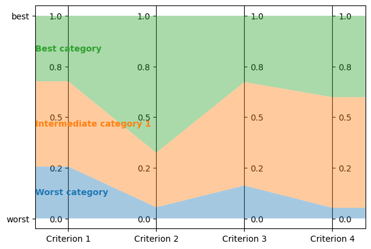
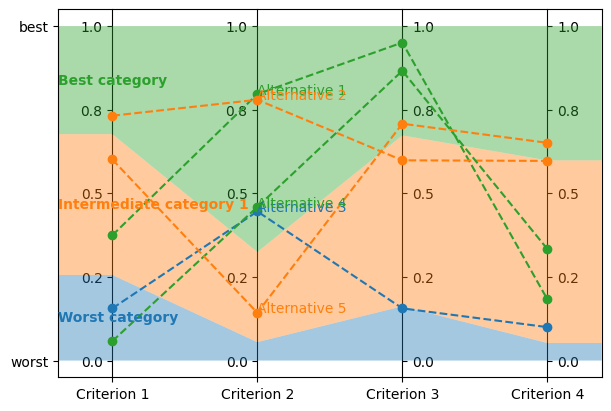
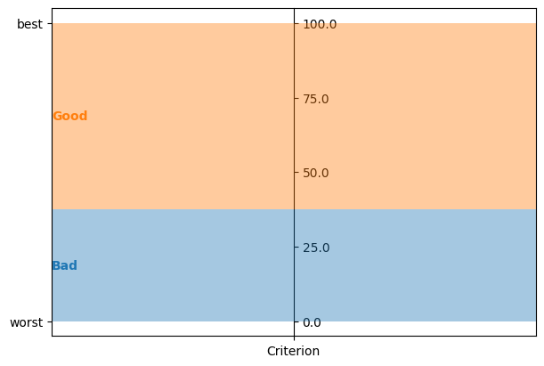
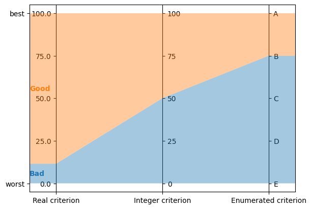
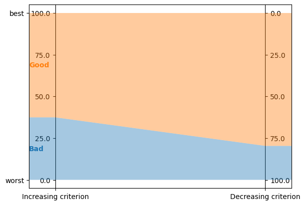
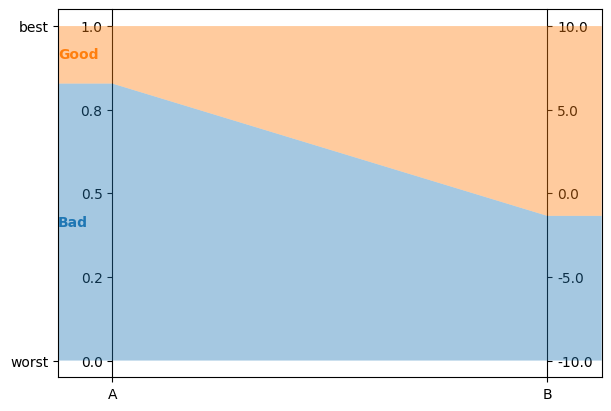
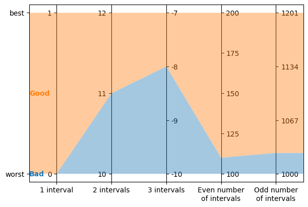

<!-- WARNING: this file is generated from 'doc-sources/python-api/python-api.ipynb'. MANUAL EDITS WILL BE LOST. -->

# The Python API

This document builds up on {doc}`our "Get Started" guide <get-started>` and our {doc}`user guide <user-guide>`, and introduces *lincs*' Python API.
This API is more flexible, albeit more complex, than the command-line interface you've been using so far.

If you're a Jupyter user, you can [download the notebook](python-api/python-api.ipynb) this document is based on.

## Do it again, in Python

First, lets do exactly the same thing as in our "Get started" guide, but using the Python API.


```python
from lincs import classification as lc
```

Generate a synthetic classification problem:


```python
problem = lc.generate_problem(criteria_count=4, categories_count=3, random_seed=40)
```

The first difference with the command-line interface is the third argument to the call to `generate_problem`: it's the pseudo-random seed optionally passed by the `--random-seed` option on the command line. All pseudo-random seeds are mandatory in the Python API, so that you have full control of reproducibility. If you don't care about it, you can use `random.randrange(2**30)` to use pseudo-random pseudo-random seeds. (No typo here: the pseudo-random seeds are pseudo-random.)

Generated problems are returned as Python objects of class `lincs.Problem`. You can print them:


```python
import sys
problem.dump(sys.stdout)
```

```yaml
kind: classification-problem
format_version: 1
criteria:
  - name: Criterion 1
    value_type: real
    preference_direction: increasing
    min_value: 0
    max_value: 1
  - name: Criterion 2
    value_type: real
    preference_direction: increasing
    min_value: 0
    max_value: 1
  - name: Criterion 3
    value_type: real
    preference_direction: increasing
    min_value: 0
    max_value: 1
  - name: Criterion 4
    value_type: real
    preference_direction: increasing
    min_value: 0
    max_value: 1
ordered_categories:
  - name: Worst category
  - name: Intermediate category 1
  - name: Best category
```


Description functions generate a list of strings:


```python
print("\n".join(lc.describe_problem(problem)))
```

```text
This a classification problem into 3 ordered categories named "Worst category", "Intermediate category 1" and "Best category".
The best category is "Best category" and the worst category is "Worst category".
There are 4 classification criteria (in no particular order).
Criterion "Criterion 1" takes real values between 0.0 and 1.0 included.
Higher values of "Criterion 1" are known to be better.
Criterion "Criterion 2" takes real values between 0.0 and 1.0 included.
Higher values of "Criterion 2" are known to be better.
Criterion "Criterion 3" takes real values between 0.0 and 1.0 included.
Higher values of "Criterion 3" are known to be better.
Criterion "Criterion 4" takes real values between 0.0 and 1.0 included.
Higher values of "Criterion 4" are known to be better.
```


Generate a synthetic MR-Sort classification model, again with an explicit pseudo-random seed:


```python
model = lc.generate_mrsort_model(problem, random_seed=41)

model.dump(problem, sys.stdout)
```

```yaml
kind: ncs-classification-model
format_version: 1
accepted_values:
  - kind: thresholds
    thresholds: [0.255905151, 0.676961303]
  - kind: thresholds
    thresholds: [0.0551739037, 0.324553937]
  - kind: thresholds
    thresholds: [0.162252158, 0.673279881]
  - kind: thresholds
    thresholds: [0.0526000932, 0.598555863]
sufficient_coalitions:
  - &coalitions
    kind: weights
    criterion_weights: [0.147771254, 0.618687689, 0.406786472, 0.0960085914]
  - *coalitions
```


Visualization functions interface with [Matplotlib](https://matplotlib.org/):


```python
import matplotlib.pyplot as plt
```


```python
axes = plt.subplots(1, 1, figsize=(6, 4), layout="constrained")[1]
lc.visualize_model(problem, model, [], axes)
```





Get the model's description:


```python
print("\n".join(lc.describe_model(problem, model)))
```

```text
This is a MR-Sort (a.k.a. 1-Uc-NCS) model: an NCS model where the sufficient coalitions are specified using the same criterion weights for all boundaries.
The weights associated to each criterion are:
  - Criterion "Criterion 1": 0.15
  - Criterion "Criterion 2": 0.62
  - Criterion "Criterion 3": 0.41
  - Criterion "Criterion 4": 0.10
To get into an upper category, an alternative must be accepted by the following boundaries on a set of criteria whose weights add up to at least 1:
  - For category "Intermediate category 1": at least 0.26 on criterion "Criterion 1", at least 0.06 on criterion "Criterion 2", at least 0.16 on criterion "Criterion 3", and at least 0.05 on criterion "Criterion 4"
  - For category "Best category": at least 0.68 on criterion "Criterion 1", at least 0.32 on criterion "Criterion 2", at least 0.67 on criterion "Criterion 3", and at least 0.60 on criterion "Criterion 4"
```


Generate a synthetic learning set (with an explicit pseudo-random seed):


```python
learning_set = lc.generate_alternatives(problem, model, alternatives_count=1000, random_seed=42)
```

Dump it (in memory instead of on `sys.stdout` to print only the first few lines):


```python
import io
f = io.StringIO()
learning_set.dump(problem, f)
print("\n".join(f.getvalue().splitlines()[:6] + ['...']))
```

```text
name,"Criterion 1","Criterion 2","Criterion 3","Criterion 4",category
"Alternative 1",0.37454012,0.796543002,0.95071429,0.183434784,"Best category"
"Alternative 2",0.731993914,0.779690981,0.598658502,0.596850157,"Intermediate category 1"
"Alternative 3",0.156018645,0.445832759,0.15599452,0.0999749228,"Worst category"
"Alternative 4",0.0580836125,0.4592489,0.866176128,0.333708614,"Best category"
"Alternative 5",0.601114988,0.14286682,0.708072603,0.650888503,"Intermediate category 1"
...
```


Visualize it:


```python
axes = plt.subplots(1, 1, figsize=(6, 4), layout="constrained")[1]
lc.visualize_model(problem, model, learning_set.alternatives[:5], axes)
```





Let's now train a new model from this synthetic learning set.
The command-line interface of `lincs learn classification-model` accepts quite a few options.
Most of them set up the strategies used for the learning, as described further in our {doc}`user guide <user-guide>`.
When using the Python API, you have to create these strategies yourself:


```python
preprocessed_learning_set = lc.PreprocessedLearningSet(problem, learning_set)
models_being_learned = lc.LearnMrsortByWeightsProfilesBreed.ModelsBeingLearned(preprocessed_learning_set, models_count=9, random_seed=43)
profiles_initialization_strategy = lc.InitializeProfilesForProbabilisticMaximalDiscriminationPowerPerCriterion(preprocessed_learning_set, models_being_learned)
weights_optimization_strategy = lc.OptimizeWeightsUsingGlop(preprocessed_learning_set, models_being_learned)
profiles_improvement_strategy = lc.ImproveProfilesWithAccuracyHeuristicOnCpu(preprocessed_learning_set, models_being_learned)
breeding_strategy = lc.ReinitializeLeastAccurate(models_being_learned, profiles_initialization_strategy=profiles_initialization_strategy, count=4)
termination_strategy = lc.TerminateAtAccuracy(models_being_learned, target_accuracy=len(learning_set.alternatives))
```

Then create the learning itself:


```python
learning = lc.LearnMrsortByWeightsProfilesBreed(
    preprocessed_learning_set,
    models_being_learned,
    profiles_initialization_strategy,
    weights_optimization_strategy,
    profiles_improvement_strategy,
    breeding_strategy,
    termination_strategy,
)
```

And `.perform` it to create the learned `Model` object:


```python
learned_model = learning.perform()
learned_model.dump(problem, sys.stdout)
```

```yaml
kind: ncs-classification-model
format_version: 1
accepted_values:
  - kind: thresholds
    thresholds: [0.339874953, 0.421424538]
  - kind: thresholds
    thresholds: [0.0556534864, 0.326433569]
  - kind: thresholds
    thresholds: [0.162616938, 0.67343241]
  - kind: thresholds
    thresholds: [0.0878681168, 0.252649099]
sufficient_coalitions:
  - &coalitions
    kind: weights
    criterion_weights: [0, 1.01327896e-06, 0.999998987, 0]
  - *coalitions
```


Create a testing set and classify it, taking notes of the accuracy of the new model on that testing set:


```python
testing_set = lc.generate_alternatives(problem, model, alternatives_count=3000, random_seed=44)
classification_result = lc.classify_alternatives(problem, learned_model, testing_set)
classification_result.changed, classification_result.unchanged
```


```text
(4, 2996)
```


This covers what was done in our "Get started" guide.
As you can see the Python API is more verbose, but for good reasons: it's more powerful as you'll see in the next section.

## Do more, with the Python API

### Create classification objects

You don't have to use our pseudo-random generation functions; you can create `Problem`, `Model`, *etc.* instances yourself.

#### Create a `Problem`


```python
problem = lc.Problem(
    criteria=[
        lc.Criterion("Physics grade", lc.Criterion.IntegerValues(lc.Criterion.PreferenceDirection.increasing, 0, 100)),
        lc.Criterion("Literature grade", lc.Criterion.EnumeratedValues(["f", "e", "d", "c", "b", "a"])),
    ],
    ordered_categories=[lc.Category("Failed"), lc.Category("Passed"), lc.Category("Congratulations")],
)

problem.dump(sys.stdout)
```

```yaml
kind: classification-problem
format_version: 1
criteria:
  - name: Physics grade
    value_type: integer
    preference_direction: increasing
    min_value: 0
    max_value: 100
  - name: Literature grade
    value_type: enumerated
    ordered_values: [f, e, d, c, b, a]
ordered_categories:
  - name: Failed
  - name: Passed
  - name: Congratulations
```


You can access all their attributes in code as well:


```python
criterion = problem.criteria[0]
```


```python
criterion.name
```


```text
'Physics grade'
```


```python
criterion.value_type, criterion.is_real, criterion.is_integer, criterion.is_enumerated
```


```text
(<ValueType.integer: 1>, False, True, False)
```


```python
values = criterion.integer_values
```


```python
values.preference_direction, values.is_increasing, values.is_decreasing
```


```text
(<PreferenceDirection.increasing: 0>, True, False)
```


```python
values.min_value, values.max_value
```


```text
(0, 100)
```


```python
criterion = problem.criteria[1]
```


```python
criterion.name
```


```text
'Literature grade'
```


```python
criterion.value_type, criterion.is_real, criterion.is_integer, criterion.is_enumerated
```


```text
(<ValueType.enumerated: 2>, False, False, True)
```


```python
values = criterion.enumerated_values
```


```python
list(values.ordered_values)
```


```text
['f', 'e', 'd', 'c', 'b', 'a']
```


```python
values.get_value_rank(value="a")
```


```text
5
```


#### Create a `Model`


```python
model = lc.Model(
    problem,
    accepted_values=[
        lc.AcceptedValues(lc.AcceptedValues.IntegerThresholds([50, 80])),
        lc.AcceptedValues(lc.AcceptedValues.EnumeratedThresholds(["c", "a"])),
    ],
    sufficient_coalitions=[
        lc.SufficientCoalitions(lc.SufficientCoalitions.Weights([0.5, 0.5])),
        lc.SufficientCoalitions(lc.SufficientCoalitions.Weights([0.5, 0.5])),
    ],
)

model.dump(problem, sys.stdout)
```

```yaml
kind: ncs-classification-model
format_version: 1
accepted_values:
  - kind: thresholds
    thresholds: [50, 80]
  - kind: thresholds
    thresholds: [c, a]
sufficient_coalitions:
  - &coalitions
    kind: weights
    criterion_weights: [0.5, 0.5]
  - *coalitions
```


```python
accepted = model.accepted_values[0]
```


```python
accepted.value_type, accepted.is_real, accepted.is_integer, accepted.is_enumerated
```


```text
(<ValueType.integer: 1>, False, True, False)
```


```python
accepted.kind, accepted.is_thresholds
```


```text
(<Kind.thresholds: 0>, True)
```


```python
list(accepted.integer_thresholds.thresholds)
```


```text
[50, 80]
```


```python
accepted = model.accepted_values[1]
```


```python
accepted.value_type, accepted.is_real, accepted.is_integer, accepted.is_enumerated
```


```text
(<ValueType.enumerated: 2>, False, False, True)
```


```python
accepted.kind, accepted.is_thresholds
```


```text
(<Kind.thresholds: 0>, True)
```


```python
list(accepted.enumerated_thresholds.thresholds)
```


```text
['c', 'a']
```


```python
sufficient = model.sufficient_coalitions[0]
```


```python
sufficient.kind, sufficient.is_weights, sufficient.is_roots
```


```text
(<Kind.weights: 0>, True, False)
```


```python
list(sufficient.weights.criterion_weights)
```


```text
[0.5, 0.5]
```


#### Create (classified) `Alternatives`


```python
alternatives = lc.Alternatives(problem, [
    lc.Alternative(
        "Unclassified alternative",
        [
            lc.Performance(lc.Performance.Integer(50)),
            lc.Performance(lc.Performance.Enumerated("c")),
        ],
        None
    ),
    lc.Alternative(
        "Classified alternative",
        [
            lc.Performance(lc.Performance.Integer(90)),
            lc.Performance(lc.Performance.Enumerated("a")),
        ],
        2
    ),
])
```


```python
alternative = alternatives.alternatives[0]
```


```python
alternative.category_index is None
```


```text
True
```


```python
performance = alternative.profile[0]
```


```python
performance.value_type, performance.is_real, performance.is_integer, performance.is_enumerated
```


```text
(<ValueType.integer: 1>, False, True, False)
```


```python
performance.integer.value
```


```text
50
```


```python
problem.ordered_categories[alternatives.alternatives[1].category_index].name
```


```text
'Congratulations'
```


### Clone classification objects

Just use [`copy.deepcopy`](https://docs.python.org/3/library/copy.html#copy.deepcopy):


```python
import copy

copied_problem = copy.deepcopy(problem)
copied_model = copy.deepcopy(model)
copied_alternatives = copy.deepcopy(alternatives)
```

This is especially useful *e.g.* if you want to identify alternatives that are classified differently by two models, because `lc.classify_alternatives` mutates the alternatives: clone the `Alternatives`, classify the copy and iterate over the [`zip`](https://docs.python.org/3/library/functions.html#zip) of both `Alternatives`, comparing their `.category_index`.

### Serialize classification objects

#### In YAML and CSV like the command-line

(and the upcoming C++ API)

Classification objects have a `.dump` method, and their classes have a static `.load` method that accept file-like objects.

We've used them above to print classification objects to `sys.stdout`. Here is an example of how to use them with actual files:


```python
with open("problem.yml", "w") as f:
    problem.dump(f)

with open("model.yml", "w") as f:
    model.dump(problem, f)

with open("alternatives.csv", "w") as f:
    alternatives.dump(problem, f)

with open("problem.yml") as f:
    problem = lc.Problem.load(f)

with open("model.yml") as f:
    model = lc.Model.load(problem, f)

with open("alternatives.csv") as f:
    alternatives = lc.Alternatives.load(problem, f)
```

And here with in-memory [io](https://docs.python.org/3/library/io.html) objects:


```python
f = io.StringIO()
problem.dump(f)
s = f.getvalue()
print(s)
```

```yaml
kind: classification-problem
format_version: 1
criteria:
  - name: Physics grade
    value_type: integer
    preference_direction: increasing
    min_value: 0
    max_value: 100
  - name: Literature grade
    value_type: enumerated
    ordered_values: [f, e, d, c, b, a]
ordered_categories:
  - name: Failed
  - name: Passed
  - name: Congratulations
```


```python
f = io.StringIO(s)
problem = lc.Problem.load(f)
```

#### Using the Python-specific `pickle` module

Classification objects simply support [pickling](https://docs.python.org/3/library/pickle.html) and unpickling. We recommend using the YAML and CSV formats whenever possible because they are not tied to the Python language (or the *lincs* library for that matter).


```python
import pickle

pickle.loads(pickle.dumps(problem)).dump(sys.stdout)
```

```yaml
kind: classification-problem
format_version: 1
criteria:
  - name: Physics grade
    value_type: integer
    preference_direction: increasing
    min_value: 0
    max_value: 100
  - name: Literature grade
    value_type: enumerated
    ordered_values: [f, e, d, c, b, a]
ordered_categories:
  - name: Failed
  - name: Passed
  - name: Congratulations
```


Note however that learning objects (*e.g.* instances of `LearnMrsortByWeightsProfilesBreed`) are *not* picklable.

### Customize the model visualization

We've decided to not implement any customization for the visualizations produced by `lincs.classification.visualize_model` (and thus `lincs visualize classification-model`) because this would make it less robust and increase its complexity beyond the scope of *lincs*.

However, `lincs.classification.visualize_model` is written in Python, using the Python API described in this guide. This means that you can get inspiration from its [source code](https://github.com/MICS-Lab/lincs/blob/main/lincs/visualization.py) (*i.e.* copy-paste it) to produce custom visualizations for your needs.

Be aware that our implementation supports a few edge cases, so it might be a bit more complex than what you actually need:

- problems and models with a single criterion are visualized in a sensible way


```python
problem = lc.Problem([lc.Criterion("Criterion", lc.Criterion.RealValues(lc.Criterion.PreferenceDirection.increasing, 0, 100))], [lc.Category("Bad"), lc.Category("Good")])
model = lc.generate_mrsort_model(problem, 42)
axes = plt.subplots(1, 1, figsize=(6, 4), layout="constrained")[1]
lc.visualize_model(problem, model, [], axes)
```





- all value types (real, integer and enumerated) are visualized on vertical axes


```python
problem = lc.Problem(
    [
        lc.Criterion("Real criterion", lc.Criterion.RealValues(lc.Criterion.PreferenceDirection.increasing, 0, 100)),
        lc.Criterion("Integer criterion", lc.Criterion.IntegerValues(lc.Criterion.PreferenceDirection.increasing, 0, 100)),
        lc.Criterion("Enumerated criterion", lc.Criterion.EnumeratedValues(["E", "D", "C", "B", "A"])),
    ],
    [lc.Category("Bad"), lc.Category("Good")]
)
model = lc.generate_mrsort_model(problem, 43)
axes = plt.subplots(1, 1, figsize=(6, 4), layout="constrained")[1]
lc.visualize_model(problem, model, [], axes)
```





- increasing and decreasing criteria are visualized with axes going up or down


```python
problem = lc.Problem(
    [
        lc.Criterion("Increasing criterion", lc.Criterion.RealValues(lc.Criterion.PreferenceDirection.increasing, 0, 100)),
        lc.Criterion("Decreasing criterion", lc.Criterion.RealValues(lc.Criterion.PreferenceDirection.decreasing, 0, 100)),
    ],
    [lc.Category("Bad"), lc.Category("Good")]
)
model = lc.generate_mrsort_model(problem, 42)
axes = plt.subplots(1, 1, figsize=(6, 4), layout="constrained")[1]
lc.visualize_model(problem, model, [], axes)
```





- any min and max values are aligned horizontally at the top and bottom of vertical axes


```python
problem = lc.Problem(
    [
        lc.Criterion("A", lc.Criterion.RealValues(lc.Criterion.PreferenceDirection.increasing, 0, 1)),
        lc.Criterion("B", lc.Criterion.RealValues(lc.Criterion.PreferenceDirection.increasing, -10, 10)),
    ],
    [lc.Category("Bad"), lc.Category("Good")]
)
model = lc.generate_mrsort_model(problem, 44)
axes = plt.subplots(1, 1, figsize=(6, 4), layout="constrained")[1]
lc.visualize_model(problem, model, [], axes)
```





- labels for integer criteria with any number of intervals


```python
problem = lc.Problem(
    [
        lc.Criterion("1 interval", lc.Criterion.IntegerValues(lc.Criterion.PreferenceDirection.increasing, 0, 1)),
        lc.Criterion("2 intervals", lc.Criterion.IntegerValues(lc.Criterion.PreferenceDirection.increasing, 10, 12)),
        lc.Criterion("3 intervals", lc.Criterion.IntegerValues(lc.Criterion.PreferenceDirection.increasing, -10, -7)),
        lc.Criterion("Even number\nof intervals", lc.Criterion.IntegerValues(lc.Criterion.PreferenceDirection.increasing, 100, 200)),
        lc.Criterion("Odd number\nof intervals", lc.Criterion.IntegerValues(lc.Criterion.PreferenceDirection.increasing, 1000, 1201)),
    ],
    [lc.Category("Bad"), lc.Category("Good")]
)
model = lc.generate_mrsort_model(problem, 43)
axes = plt.subplots(1, 1, figsize=(6, 4), layout="constrained")[1]
lc.visualize_model(problem, model, [], axes)
```





### Create your own learning strategies

The "Weights, profiles, breed" learning approach uses strategies for each of its steps. *lincs* provides effective strategies as you've seen in the first part of this guide. You can also define your own strategies, to experiment with new ways to learn.

Let's create a problem and learning set for this section:


```python
problem = lc.Problem(
    [
        lc.Criterion("Criterion 1", lc.Criterion.RealValues(lc.Criterion.PreferenceDirection.decreasing, 0, 10)),
        lc.Criterion("Criterion 2", lc.Criterion.IntegerValues(lc.Criterion.PreferenceDirection.increasing, 0, 100)),
        lc.Criterion("Criterion 3", lc.Criterion.EnumeratedValues(["F", "E", "D", "C", "B", "A"])),
    ],
    [lc.Category("Bad"), lc.Category("Medium"), lc.Category("Good")],
)
learning_set = lc.generate_alternatives(problem, lc.generate_mrsort_model(problem, random_seed=42), alternatives_count=1000, random_seed=43)
```

#### `ModelsBeingLearned`

First, let's get more familiar with the `ModelsBeingLearned`. You've seen it briefly in the first part of this guide but its purpose might still be quite obscure at this point.


```python
preprocessed_learning_set = lc.PreprocessedLearningSet(problem, learning_set)
models_being_learned = lc.LearnMrsortByWeightsProfilesBreed.ModelsBeingLearned(preprocessed_learning_set, models_count=9, random_seed=43)
```

This object is shared by all strategies. They communicate by changing it, using side effects. It's the state of the WPB algorithm. It contains two families of attributes.

##### Input data

The first family of attributes is about the problem and learning set. These attributes never change. First, the counts:


```python
(preprocessed_learning_set.criteria_count, preprocessed_learning_set.categories_count, preprocessed_learning_set.boundaries_count, preprocessed_learning_set.alternatives_count)
```


```text
(3, 3, 2, 1000)
```


The learning set is pre-processed in the `ModelsBeingLearned` so that the WPB algorithm doesn't have to manipulate the different type of criterion values. In the `ModelsBeingLearned`, we keep only the ranks of the performances of each alternative in the learning set. The learning set is also destructured into a few arrays. Here are the attributes that describe this pre-processed learning set:

The number of distinct values actually seen for each criterion (including the min and max values for numerical criteria):


```python
list(preprocessed_learning_set.values_counts)  # Indexed by [criterion_index]
```


```text
[1002, 101, 6]
```


We see that the learning data knows 1002 values for the real-valued criterion. This is usual as it's rare for two floating point values to be exactly equal, so the 1000 alternatives have distinct values, and the min and max are two more values. The learning data contains 101 values for the integer-valued criterion, meaning that the alternatives in the learning set do actually cover the whole set of possible values. And similarly, 6 values for the enumerated criterion.

For each criterion, the ranks of the performance of each alternative:


```python
[list(v)[:10] + ['...'] for v in preprocessed_learning_set.performance_ranks]  # Indexed by [criterion_index][alternative_index]
```


```text
[[883, 900, 753, 216, 365, 410, 302, 852, 738, 45, '...'],
 [50, 13, 17, 86, 4, 2, 25, 81, 47, 87, '...'],
 [3, 0, 1, 0, 3, 3, 2, 0, 0, 3, '...']]
```


The assignment of each alternative, *i.e.* the index of its category:


```python
list(preprocessed_learning_set.assignments)[:10] + ['...']  # Indexed by [alternative_index]
```


```text
[2, 2, 2, 0, 1, 1, 1, 2, 2, 0, '...']
```


All these attributes are iterable and allow random access through an integer index. They do not support splicing.


```python
preprocessed_learning_set.assignments[0]
```


```text
2
```


##### In-progress data

The second family of attributes is about the WPB algorithm itself.

The WPB approach operates on several "in progress" models. Their number is constant:


```python
models_being_learned.models_count
```


```text
9
```


Each model comes with a uniform random bits generator:


```python
[str(random_generator)[:43] + '>' for random_generator in models_being_learned.random_generators]  # Indexed by [model_index]
```


```text
['<liblincs.UniformRandomBitsGenerator object>',
 '<liblincs.UniformRandomBitsGenerator object>',
 '<liblincs.UniformRandomBitsGenerator object>',
 '<liblincs.UniformRandomBitsGenerator object>',
 '<liblincs.UniformRandomBitsGenerator object>',
 '<liblincs.UniformRandomBitsGenerator object>',
 '<liblincs.UniformRandomBitsGenerator object>',
 '<liblincs.UniformRandomBitsGenerator object>',
 '<liblincs.UniformRandomBitsGenerator object>']
```


This lets heuristic strategies operate in parallel on models and still produce deterministic results. Random generators are callable to get the next pseudo-random integer:


```python
[r() for r in models_being_learned.random_generators]
```


```text
[494155588,
 870190228,
 2450414687,
 641676058,
 661088198,
 363471047,
 1448606581,
 1348129397,
 2542538607]
```


The WPB learning approach is iterative, and the `iteration_index` is stored in the learning data. It starts at zero and tells you the current iteration:


```python
models_being_learned.iteration_index
```


```text
0
```


The remaining attributes are modified at each iteration, and start uninitialized. For this presentation, we'll first run one iteration of WPB so that their values make sense.


```python
preprocessed_learning_set = lc.PreprocessedLearningSet(problem, learning_set)
models_being_learned = lc.LearnMrsortByWeightsProfilesBreed.ModelsBeingLearned(preprocessed_learning_set, models_count=9, random_seed=43)
profiles_initialization_strategy = lc.InitializeProfilesForProbabilisticMaximalDiscriminationPowerPerCriterion(preprocessed_learning_set, models_being_learned)
weights_optimization_strategy = lc.OptimizeWeightsUsingGlop(preprocessed_learning_set, models_being_learned)
profiles_improvement_strategy = lc.ImproveProfilesWithAccuracyHeuristicOnCpu(preprocessed_learning_set, models_being_learned)
breeding_strategy = lc.ReinitializeLeastAccurate(models_being_learned, profiles_initialization_strategy=profiles_initialization_strategy, count=4)
termination_strategy = lc.TerminateAfterIterations(models_being_learned, max_iterations_count=1)

lc.LearnMrsortByWeightsProfilesBreed(
    preprocessed_learning_set,
    models_being_learned,
    profiles_initialization_strategy,
    weights_optimization_strategy,
    profiles_improvement_strategy,
    breeding_strategy,
    termination_strategy,
).perform()

assert(models_being_learned.iteration_index == 0)
```

Its `model_indexes` contains indexes of models in increasing order of accuracy.


```python
list(models_being_learned.model_indexes)
```


```text
[1, 5, 4, 8, 3, 6, 2, 0, 7]
```


Its `accuracies` attribute holds the accuracy of each model. They are stored as the count of correctly-classified alternatives, between 0 and `alternatives_count` included:


```python
list(models_being_learned.accuracies)  # Indexed by model_index
```


```text
[728, 593, 725, 671, 637, 609, 676, 833, 640]
```


If you iterate the `accuracies` in the order of `model_indexes`, they are sorted:


```python
[models_being_learned.accuracies[index] for index in models_being_learned.model_indexes] == sorted(models_being_learned.accuracies)
```


```text
True
```


Its `low_profile_ranks` hold, for each in-progress model, boundary, and criterion, the rank of the boundary's performance, on the same scale as the `performance_ranks` attributes.


```python
[[list(vv) for vv in v] for v in models_being_learned.low_profile_ranks]  # Indexed by [model_index][boundary_index][criterion_index]
```


```text
[[[124, 9, 0], [633, 9, 3]],
 [[492, 8, 1], [965, 8, 4]],
 [[268, 15, 0], [506, 54, 3]],
 [[230, 8, 1], [272, 26, 4]],
 [[201, 1, 1], [201, 2, 3]],
 [[86, 64, 0], [86, 99, 0]],
 [[223, 60, 2], [310, 80, 5]],
 [[235, 20, 2], [595, 20, 3]],
 [[261, 52, 0], [262, 52, 3]]]
```


Its `weights` attribute holds the MR-Sort weight of each criterion in each in-progress model.


```python
[list(v) for v in models_being_learned.weights]  # Indexed by [model_index][criterion_index]
```


```text
[[1.0132789611816406e-06, 0.9999989867210388, 1.0132789611816406e-06],
 [0.9999989867210388, 0.9999989867210388, 1.0132789611816406e-06],
 [1.0, 0.0, 0.9999989867210388],
 [0.5000004768371582, 0.4999994933605194, 0.4999994933605194],
 [1.0132789611816406e-06, 0.9999989867210388, 0.0],
 [0.9999989867210388, 0.0, 1.0132789611816406e-06],
 [1.0, 0.0, 0.0],
 [1.0, 0.9999989867210388, 1.0132789611816406e-06],
 [0.9999989867210388, 0.0, 0.9999989867210388]]
```


Finally, `ModelsBeingLearned` has two methods about the best model so far: `get_best_model` and `get_best_accuracy`, which respectively return the best `Model` so far and its accuracy.


```python
models_being_learned.get_best_model().dump(problem, sys.stdout)
```

```yaml
kind: ncs-classification-model
format_version: 1
accepted_values:
  - kind: thresholds
    thresholds: [7.7909708, 4.06594753]
  - kind: thresholds
    thresholds: [20, 20]
  - kind: thresholds
    thresholds: [D, C]
sufficient_coalitions:
  - &coalitions
    kind: weights
    criterion_weights: [1, 0.999998987, 1.01327896e-06]
  - *coalitions
```


```python
models_being_learned.get_best_accuracy()
```


```text
833
```


#### `Observer` strategies

With this hopefully better understanding of `ModelsBeingLearned`, let's write our own `Observer` strategy.
It's arguably the simplest to starts with, because it's not expected to *change* the `ModelsBeingLearned`, but only *observe* it at some key points of the learning.

To start as simple as possible, lets reproduce the behavior of the `--...-verbose` flag on the command line, by creating an observer that just prints the best accuracy at each step.

`Observer` strategies must define two methods to be called by the learning algorithm: `after_iteration`, to be called at the end of each iteration, after the breeding of models is done, and `before_return`, to be called just before the final model is returned.


```python
class VerboseObserver(lc.LearnMrsortByWeightsProfilesBreed.Observer):
    def __init__(self, models_being_learned):
        super().__init__()
        self.models_being_learned = models_being_learned

    def after_iteration(self):
        print(f"Best accuracy (after {self.models_being_learned.iteration_index + 1} iterations): {self.models_being_learned.get_best_accuracy()}")

    def before_return(self):
        print(f"Final accuracy (after {self.models_being_learned.iteration_index + 1} iterations): {self.models_being_learned.get_best_accuracy()}")
```

We can now pass it to a learning and perform that learning to observe its effects:


```python
profiles_initialization_strategy = lc.InitializeProfilesForProbabilisticMaximalDiscriminationPowerPerCriterion(preprocessed_learning_set, models_being_learned)
weights_optimization_strategy = lc.OptimizeWeightsUsingGlop(preprocessed_learning_set, models_being_learned)
profiles_improvement_strategy = lc.ImproveProfilesWithAccuracyHeuristicOnCpu(preprocessed_learning_set, models_being_learned)
breeding_strategy = lc.ReinitializeLeastAccurate(models_being_learned, profiles_initialization_strategy=profiles_initialization_strategy, count=4)
termination_strategy = lc.TerminateAtAccuracy(models_being_learned, target_accuracy=len(learning_set.alternatives))
observer = VerboseObserver(models_being_learned)

learned_model = lc.LearnMrsortByWeightsProfilesBreed(
    preprocessed_learning_set,
    models_being_learned,
    profiles_initialization_strategy,
    weights_optimization_strategy,
    profiles_improvement_strategy,
    breeding_strategy,
    termination_strategy,
    [observer],
).perform()
```

```text
Best accuracy (after 1 iterations): 938
Best accuracy (after 2 iterations): 992
Best accuracy (after 3 iterations): 997
Best accuracy (after 4 iterations): 997
Best accuracy (after 5 iterations): 997
Best accuracy (after 6 iterations): 997
Best accuracy (after 7 iterations): 997
Best accuracy (after 8 iterations): 999
Final accuracy (after 9 iterations): 1000
```


Now let's do something slightly more complicated: our goal for `IntermediatesObserver` is to keep track of the best model so far at different times during the learning. Specifically, we want to keep the models at iterations 1, 2, 4, 8, *etc.*.


```python
import math

class IntermediatesObserver(lc.LearnMrsortByWeightsProfilesBreed.Observer):
    def __init__(self, problem, models_being_learned):
        super().__init__()
        self.problem = problem
        self.models_being_learned = models_being_learned
        self.intermediate_models = []

    def after_iteration(self):
        if math.log2(self.models_being_learned.iteration_index + 1).is_integer():
            self.intermediate_models.append(self.models_being_learned.get_best_model())

    def before_return(self):
        pass

preprocessed_learning_set = lc.PreprocessedLearningSet(problem, learning_set)
models_being_learned = lc.LearnMrsortByWeightsProfilesBreed.ModelsBeingLearned(preprocessed_learning_set, models_count=9, random_seed=43)  # Do *not* reuse the same `ModelsBeingLearned` for several learnings
profiles_initialization_strategy = lc.InitializeProfilesForProbabilisticMaximalDiscriminationPowerPerCriterion(preprocessed_learning_set, models_being_learned)
weights_optimization_strategy = lc.OptimizeWeightsUsingGlop(preprocessed_learning_set, models_being_learned)
profiles_improvement_strategy = lc.ImproveProfilesWithAccuracyHeuristicOnCpu(preprocessed_learning_set, models_being_learned)
breeding_strategy = lc.ReinitializeLeastAccurate(models_being_learned, profiles_initialization_strategy=profiles_initialization_strategy, count=4)
termination_strategy = lc.TerminateAtAccuracy(models_being_learned, target_accuracy=len(learning_set.alternatives))
observer = IntermediatesObserver(problem, models_being_learned)

final_model = lc.LearnMrsortByWeightsProfilesBreed(
    preprocessed_learning_set,
    models_being_learned,
    profiles_initialization_strategy,
    weights_optimization_strategy,
    profiles_improvement_strategy,
    breeding_strategy,
    termination_strategy,
    [observer],
).perform()

for model in observer.intermediate_models:
    model.dump(problem, sys.stdout)
final_model.dump(problem, sys.stdout)
```

```yaml
kind: ncs-classification-model
format_version: 1
accepted_values:
  - kind: thresholds
    thresholds: [7.7909708, 4.06594753]
  - kind: thresholds
    thresholds: [20, 20]
  - kind: thresholds
    thresholds: [D, C]
sufficient_coalitions:
  - &coalitions
    kind: weights
    criterion_weights: [1, 0.999998987, 1.01327896e-06]
  - *coalitions
kind: ncs-classification-model
format_version: 1
accepted_values:
  - kind: thresholds
    thresholds: [7.95116329, 3.89878368]
  - kind: thresholds
    thresholds: [0, 21]
  - kind: thresholds
    thresholds: [C, B]
sufficient_coalitions:
  - &coalitions
    kind: weights
    criterion_weights: [1, 0, 1]
  - *coalitions
kind: ncs-classification-model
format_version: 1
accepted_values:
  - kind: thresholds
    thresholds: [7.96338844, 3.82566905]
  - kind: thresholds
    thresholds: [73, 84]
  - kind: thresholds
    thresholds: [B, B]
sufficient_coalitions:
  - &coalitions
    kind: weights
    criterion_weights: [1, 0, 1]
  - *coalitions
kind: ncs-classification-model
format_version: 1
accepted_values:
  - kind: thresholds
    thresholds: [7.96338844, 3.74707603]
  - kind: thresholds
    thresholds: [94, 99]
  - kind: thresholds
    thresholds: [B, B]
sufficient_coalitions:
  - &coalitions
    kind: weights
    criterion_weights: [1, 0, 1]
  - *coalitions
kind: ncs-classification-model
format_version: 1
accepted_values:
  - kind: thresholds
    thresholds: [7.95116329, 3.74707603]
  - kind: thresholds
    thresholds: [94, 99]
  - kind: thresholds
    thresholds: [B, B]
sufficient_coalitions:
  - &coalitions
    kind: weights
    criterion_weights: [1, 0, 1]
  - *coalitions
```


#### Other strategies

Coming up with new interesting strategies is far from easy, so in this guide, we'll just describe the interfaces that the WPB approach expects from these strategies, and not even *try* to do anything intelligent. That part is up to you!

Each strategy must inherit from a given abstract base class, as you can see below. Each strategy must override a given method as is detailed below.

Profiles initialization strategies must implement `.initialize_profiles(model_indexes_begin, model_indexes_end)`, that should initialize all `low_profile_ranks` and `high_profile_ranks` for models at indexes in `[models_being_learned.model_index[i] for i in range(model_indexes_begin, model_indexes_end)]`.


```python
class SillyProfilesInitializationStrategy(lc.LearnMrsortByWeightsProfilesBreed.ProfilesInitializationStrategy):
    def __init__(self, preprocessed_learning_set, models_being_learned):
        super().__init__()
        self.preprocessed_learning_set = preprocessed_learning_set
        self.models_being_learned = models_being_learned

    def initialize_profiles(self, model_indexes_begin, model_indexes_end):
        print("initialize_profiles", model_indexes_begin, model_indexes_end, file=sys.stderr)
        for model_index_index in range(model_indexes_begin, model_indexes_end):
            model_index = models_being_learned.model_indexes[model_index_index]
            for boundary_index in range(self.preprocessed_learning_set.boundaries_count):
                for criterion_index in range(self.preprocessed_learning_set.criteria_count):
                    self.models_being_learned.low_profile_ranks[model_index][boundary_index][criterion_index] = 0
```

Weights optimization strategies must implement `.optimize_weights(model_indexes_begin, model_indexes_end)`, that should optimize all `weights` for models at indexes in `[models_being_learned.model_index[i] for i in range(model_indexes_begin, model_indexes_end)]`.


```python
class SillyWeightsOptimizationStrategy(lc.LearnMrsortByWeightsProfilesBreed.WeightsOptimizationStrategy):
    def __init__(self, preprocessed_learning_set, models_being_learned):
        super().__init__()
        self.preprocessed_learning_set = preprocessed_learning_set
        self.models_being_learned = models_being_learned

    def optimize_weights(self, model_indexes_begin, model_indexes_end):
        print("optimize_weights", model_indexes_begin, model_indexes_end, file=sys.stderr)
        for model_index_index in range(model_indexes_begin, model_indexes_end):
            model_index = models_being_learned.model_indexes[model_index_index]
            for criterion_index in range(self.preprocessed_learning_set.criteria_count):
                self.models_being_learned.weights[model_index][criterion_index] = 1.1 / self.preprocessed_learning_set.criteria_count
```

Profiles improvement strategies must implement `.improve_profiles(model_indexes_begin, model_indexes_end)`, that should improve `low_profile_ranks` and `high_profile_ranks` for models at indexes in `[models_being_learned.model_index[i] for i in range(model_indexes_begin, model_indexes_end)]`.


```python
class SillyProfilesImprovementStrategy(lc.LearnMrsortByWeightsProfilesBreed.ProfilesImprovementStrategy):
    def __init__(self, preprocessed_learning_set, models_being_learned):
        super().__init__()
        self.preprocessed_learning_set = preprocessed_learning_set
        self.models_being_learned = models_being_learned

    def improve_profiles(self, model_indexes_begin, model_indexes_end):
        print("improve_profiles", model_indexes_begin, model_indexes_end, file=sys.stderr)
        for model_index_index in range(model_indexes_begin, model_indexes_end):
            model_index = self.models_being_learned.model_indexes[model_index_index]
            for boundary_index in range(self.preprocessed_learning_set.boundaries_count):
                for criterion_index in range(self.preprocessed_learning_set.criteria_count):
                    rank = (boundary_index + 1) * (self.preprocessed_learning_set.values_counts[criterion_index] // (self.preprocessed_learning_set.boundaries_count + 1))
                    self.models_being_learned.low_profile_ranks[model_index][boundary_index][criterion_index] = rank
```

Breeding strategies must implement `.breed()`, that should breed all models.


```python
class SillyBreedingStrategy(lc.LearnMrsortByWeightsProfilesBreed.BreedingStrategy):
    def __init__(self, models_being_learned):
        super().__init__()
        self.models_being_learned = models_being_learned

    def breed(self):
        print("breed", file=sys.stderr)
```

Termination strategies must implement `.terminate()`, that should return `True` to terminate the learning.


```python
class SillyTerminationStrategy(lc.LearnMrsortByWeightsProfilesBreed.TerminationStrategy):
    def __init__(self, models_being_learned):
        super().__init__()
        self.models_being_learned = models_being_learned

    def terminate(self):
        print("terminate", file=sys.stderr)
        return self.models_being_learned.iteration_index == 3
```


```python
problem = lc.Problem(
    [
        lc.Criterion("Criterion 1", lc.Criterion.RealValues(lc.Criterion.PreferenceDirection.decreasing, 0, 10)),
        lc.Criterion("Criterion 2", lc.Criterion.IntegerValues(lc.Criterion.PreferenceDirection.increasing, 0, 100)),
        lc.Criterion("Criterion 3", lc.Criterion.EnumeratedValues(["F", "E", "D", "C", "B", "A"])),
    ],
    [lc.Category("Bad"), lc.Category("Medium"), lc.Category("Good")],
)
learning_set = lc.generate_alternatives(problem, lc.generate_mrsort_model(problem, random_seed=42), alternatives_count=1000, random_seed=43)

preprocessed_learning_set = lc.PreprocessedLearningSet(problem, learning_set)
models_being_learned = lc.LearnMrsortByWeightsProfilesBreed.ModelsBeingLearned(preprocessed_learning_set, models_count=9, random_seed=43)
profiles_initialization_strategy = SillyProfilesInitializationStrategy(preprocessed_learning_set, models_being_learned)
weights_optimization_strategy = SillyWeightsOptimizationStrategy(preprocessed_learning_set, models_being_learned)
profiles_improvement_strategy = SillyProfilesImprovementStrategy(preprocessed_learning_set, models_being_learned)
breeding_strategy = SillyBreedingStrategy(models_being_learned)
termination_strategy = SillyTerminationStrategy(models_being_learned)
```

Here are the logs produced by these silly strategies during the learning:


```python
learned_model = lc.LearnMrsortByWeightsProfilesBreed(
    preprocessed_learning_set,
    models_being_learned,
    profiles_initialization_strategy,
    weights_optimization_strategy,
    profiles_improvement_strategy,
    breeding_strategy,
    termination_strategy,
).perform()
```

```text
initialize_profiles 0 9
optimize_weights 0 9
improve_profiles 0 9
terminate
breed
optimize_weights 0 9
improve_profiles 0 9
terminate
breed
optimize_weights 0 9
improve_profiles 0 9
terminate
breed
optimize_weights 0 9
improve_profiles 0 9
terminate
```


And here is the silly model they produce:


```python
learned_model.dump(problem, sys.stdout)
```

```yaml
kind: ncs-classification-model
format_version: 1
accepted_values:
  - kind: thresholds
    thresholds: [6.94936371, 3.24692106]
  - kind: thresholds
    thresholds: [33, 66]
  - kind: thresholds
    thresholds: [D, B]
sufficient_coalitions:
  - &coalitions
    kind: weights
    criterion_weights: [0.366666675, 0.366666675, 0.366666675]
  - *coalitions
```

