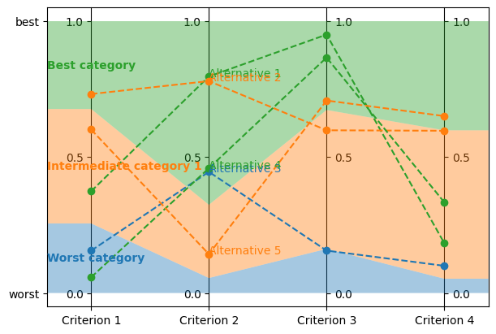

.. WARNING: this file is generated from 'doc-sources/python-api/python-api.ipynb'. MANUAL EDITS WILL BE LOST.

The Python API
==============

This document builds up on :doc:`our "Get Started"
guide <get-started>` and our
:doc:`user guide <user-guide>`, and
introduces *lincs*' Python API. This API is more flexible, albeit more
complex, than the command-line interface you've been using so far.

Do it again, in Python
----------------------

First, lets do exactly the same thing as in our "Get started" guide, but
using the Python API.

.. code:: python

    from lincs import classification as lc

Generate a synthetic classification problem:

.. code:: python

    problem = lc.generate_problem(criteria_count=4, categories_count=3, random_seed=40)

The first difference with the command-line interface is the third
argument to the call to ``generate_problem``: it's the pseudo-random
seed optionally passed by the ``--random-seed`` option on the command
line. All pseudo-random seeds are mandatory in the Python API, so that
you have full control of reproducibility. If you don't care about it,
you can use ``random.randrange(2**30)`` to use pseudo-random
pseudo-random seeds. (No typo here: the pseudo-random seeds are
pseudo-random.)

Generated problems are returned as Python objects of class
``lincs.Problem``. You can print them:

.. code:: python

    import sys
    problem.dump(sys.stdout)

.. code:: yaml

    kind: classification-problem
    format_version: 1
    criteria:
      - name: Criterion 1
        value_type: real
        preference_direction: increasing
        min_value: 0
        max_value: 1
      - name: Criterion 2
        value_type: real
        preference_direction: increasing
        min_value: 0
        max_value: 1
      - name: Criterion 3
        value_type: real
        preference_direction: increasing
        min_value: 0
        max_value: 1
      - name: Criterion 4
        value_type: real
        preference_direction: increasing
        min_value: 0
        max_value: 1
    ordered_categories:
      - name: Worst category
      - name: Intermediate category 1
      - name: Best category

Description functions generate a list of strings:

.. code:: python

    print("\n".join(lc.describe_problem(problem)))

.. code:: text

    This a classification problem into 3 ordered categories named "Worst category", "Intermediate category 1" and "Best category".
    The best category is "Best category" and the worst category is "Worst category".
    There are 4 classification criteria (in no particular order).
    Criterion "Criterion 1" takes real values between 0.0 and 1.0 included.
    Higher values of "Criterion 1" are known to be better.
    Criterion "Criterion 2" takes real values between 0.0 and 1.0 included.
    Higher values of "Criterion 2" are known to be better.
    Criterion "Criterion 3" takes real values between 0.0 and 1.0 included.
    Higher values of "Criterion 3" are known to be better.
    Criterion "Criterion 4" takes real values between 0.0 and 1.0 included.
    Higher values of "Criterion 4" are known to be better.

Generate a synthetic MR-Sort classification model, again with an
explicit pseudo-random seed:

.. code:: python

    model = lc.generate_mrsort_model(problem, random_seed=41)
    
    model.dump(problem, sys.stdout)

.. code:: yaml

    kind: ncs-classification-model
    format_version: 1
    accepted_values:
      - kind: thresholds
        thresholds: [0.255905151, 0.676961303]
      - kind: thresholds
        thresholds: [0.0551739037, 0.324553937]
      - kind: thresholds
        thresholds: [0.162252158, 0.673279881]
      - kind: thresholds
        thresholds: [0.0526000932, 0.598555863]
    sufficient_coalitions:
      - &coalitions
        kind: weights
        criterion_weights: [0.147771254, 0.618687689, 0.406786472, 0.0960085914]
      - *coalitions

Visualization functions interface with
`Matplotlib <https://matplotlib.org/>`__:

.. code:: python

    import matplotlib.pyplot as plt

.. code:: python

    axes = plt.subplots(1, 1, figsize=(6, 4), layout="constrained")[1]
    lc.visualize_model(problem, model, [], axes)

.. image:: python-api_files/python-api_13_0.png

Get the model's description:

.. code:: python

    print("\n".join(lc.describe_model(problem, model)))

.. code:: text

    This is a MR-Sort (a.k.a. 1-Uc-NCS) model: an NCS model where the sufficient coalitions are specified using the same criterion weights for all boundaries.
    The weights associated to each criterion are:
      - Criterion "Criterion 1": 0.15
      - Criterion "Criterion 2": 0.62
      - Criterion "Criterion 3": 0.41
      - Criterion "Criterion 4": 0.10
    To get into an upper category, an alternative must be better than the following profiles on a set of criteria whose weights add up to at least 1:
      - For category "Intermediate category 1": at least 0.26 on criterion "Criterion 1", at least 0.06 on criterion "Criterion 2", at least 0.16 on criterion "Criterion 3", and at least 0.05 on criterion "Criterion 4"
      - For category "Best category": at least 0.68 on criterion "Criterion 1", at least 0.32 on criterion "Criterion 2", at least 0.67 on criterion "Criterion 3", and at least 0.60 on criterion "Criterion 4"

Generate a synthetic learning set (with an explicit pseudo-random seed):

.. code:: python

    learning_set = lc.generate_classified_alternatives(problem, model, alternatives_count=1000, random_seed=42)

Dump it (in memory instead of on ``sys.stdout`` to print only the first
few lines):

.. code:: python

    import io
    f = io.StringIO()
    learning_set.dump(problem, f)
    print("\n".join(f.getvalue().splitlines()[:6]))

.. code:: text

    name,"Criterion 1","Criterion 2","Criterion 3","Criterion 4",category
    "Alternative 1",0.37454012,0.796543002,0.95071429,0.183434784,"Best category"
    "Alternative 2",0.731993914,0.779690981,0.598658502,0.596850157,"Intermediate category 1"
    "Alternative 3",0.156018645,0.445832759,0.15599452,0.0999749228,"Worst category"
    "Alternative 4",0.0580836125,0.4592489,0.866176128,0.333708614,"Best category"
    "Alternative 5",0.601114988,0.14286682,0.708072603,0.650888503,"Intermediate category 1"

Visualize it:

.. code:: python

    axes = plt.subplots(1, 1, figsize=(6, 4), layout="constrained")[1]
    lc.visualize_model(problem, model, learning_set.alternatives[:5], axes)

Let's now train a new model from this synthetic learning set. The
command-line interface of ``lincs learn classification-model`` accepts
quite a few options. Most of them set up the strategies used for the
learning, as described further in our `user
guide <user-guide>`. When using
the Python API, you have to create these strategies yourself:

.. code:: python

    learning_data = lc.LearnMrsortByWeightsProfilesBreed.LearningData(problem, learning_set, models_count=9, random_seed=43)
    profiles_initialization_strategy = lc.InitializeProfilesForProbabilisticMaximalDiscriminationPowerPerCriterion(learning_data)
    weights_optimization_strategy = lc.OptimizeWeightsUsingGlop(learning_data)
    profiles_improvement_strategy = lc.ImproveProfilesWithAccuracyHeuristicOnCpu(learning_data)
    breeding_strategy = lc.ReinitializeLeastAccurate(learning_data, profiles_initialization_strategy=profiles_initialization_strategy, count=4)
    termination_strategy = lc.TerminateAtAccuracy(learning_data, target_accuracy=len(learning_set.alternatives))

Then create the learning itself:

.. code:: python

    learning = lc.LearnMrsortByWeightsProfilesBreed(
        learning_data,
        profiles_initialization_strategy,
        weights_optimization_strategy,
        profiles_improvement_strategy,
        breeding_strategy,
        termination_strategy,
    )

And ``.perform`` it to create the learned ``Model`` object:

.. code:: python

    learned_model = learning.perform()
    learned_model.dump(problem, sys.stdout)

.. code:: yaml

    kind: ncs-classification-model
    format_version: 1
    accepted_values:
      - kind: thresholds
        thresholds: [0.339874953, 0.421424538]
      - kind: thresholds
        thresholds: [0.0556534864, 0.326433569]
      - kind: thresholds
        thresholds: [0.162616938, 0.67343241]
      - kind: thresholds
        thresholds: [0.0878681168, 0.252649099]
    sufficient_coalitions:
      - &coalitions
        kind: weights
        criterion_weights: [0, 1.01327896e-06, 0.999998987, 0]
      - *coalitions

Create a testing set and classify it, taking notes of the accuracy of
the new model on that testing set:

.. code:: python

    testing_set = lc.generate_classified_alternatives(problem, model, alternatives_count=3000, random_seed=44)
    classification_result = lc.classify_alternatives(problem, learned_model, testing_set)
    classification_result.changed, classification_result.unchanged

.. code:: text

    (4, 2996)

This covers what was done in our "Get started" guide. As you can see the
Python API is more verbose, but for good reasons: it's more powerful as
you'll see in the next section.

Do more, with the Python API
----------------------------

@todo(Documentation, v1.1) Write this section

Create classification objects
~~~~~~~~~~~~~~~~~~~~~~~~~~~~~

You don't have to use our pseudo-random generation functions; you can
create ``Problem``, ``Model``, *etc.* instances yourself.

Create a ``Problem``
^^^^^^^^^^^^^^^^^^^^

.. code:: python

    problem = lc.Problem(
        criteria=[
            lc.Criterion("Physics grade", lc.Criterion.IntegerValues(lc.Criterion.PreferenceDirection.increasing, 0, 100)),
            lc.Criterion("Literature grade", lc.Criterion.EnumeratedValues(["f", "e", "d", "c", "b", "a"])),
        ],
        categories=[lc.Category("Failed"), lc.Category("Passed"), lc.Category("Congratulations")],
    )
    
    problem.dump(sys.stdout)

.. code:: yaml

    kind: classification-problem
    format_version: 1
    criteria:
      - name: Physics grade
        value_type: integer
        preference_direction: increasing
        min_value: 0
        max_value: 100
      - name: Literature grade
        value_type: enumerated
        ordered_values: [f, e, d, c, b, a]
    ordered_categories:
      - name: Failed
      - name: Passed
      - name: Congratulations

You can access all their attributes in code as well:

.. code:: python

    criterion = problem.criteria[0]

.. code:: python

    criterion.name

.. code:: text

    'Physics grade'

.. code:: python

    criterion.value_type, criterion.is_real, criterion.is_integer, criterion.is_enumerated

.. code:: text

    (liblincs.ValueType.integer, False, True, False)

.. code:: python

    values = criterion.integer_values

.. code:: python

    values.preference_direction, values.is_increasing, values.is_decreasing

.. code:: text

    (liblincs.PreferenceDirection.isotone, True, False)

.. code:: python

    values.min_value, values.max_value

.. code:: text

    (0, 100)

.. code:: python

    criterion = problem.criteria[1]

.. code:: python

    criterion.name

.. code:: text

    'Literature grade'

.. code:: python

    criterion.value_type, criterion.is_real, criterion.is_integer, criterion.is_enumerated

.. code:: text

    (liblincs.ValueType.enumerated, False, False, True)

.. code:: python

    values = criterion.enumerated_values

.. code:: python

    list(values.ordered_values)

.. code:: text

    ['f', 'e', 'd', 'c', 'b', 'a']

.. code:: python

    values.get_value_rank(value="a")

.. code:: text

    5

Create a ``Model``
^^^^^^^^^^^^^^^^^^

.. code:: python

    model = lc.Model(
        problem,
        accepted_values=[
            lc.AcceptedValues(lc.AcceptedValues.IntegerThresholds([50, 80])),
            lc.AcceptedValues(lc.AcceptedValues.EnumeratedThresholds(["c", "a"])),
        ],
        sufficient_coalitions=[
            lc.SufficientCoalitions(lc.SufficientCoalitions.Weights([0.5, 0.5])),
            lc.SufficientCoalitions(lc.SufficientCoalitions.Weights([0.5, 0.5])),
        ],
    )
    
    model.dump(problem, sys.stdout)

.. code:: yaml

    kind: ncs-classification-model
    format_version: 1
    accepted_values:
      - kind: thresholds
        thresholds: [50, 80]
      - kind: thresholds
        thresholds: [c, a]
    sufficient_coalitions:
      - &coalitions
        kind: weights
        criterion_weights: [0.5, 0.5]
      - *coalitions

.. code:: python

    accepted = model.accepted_values[0]

.. code:: python

    accepted.value_type, accepted.is_real, accepted.is_integer, accepted.is_enumerated

.. code:: text

    (liblincs.ValueType.integer, False, True, False)

.. code:: python

    accepted.kind, accepted.is_thresholds

.. code:: text

    (liblincs.Kind.thresholds, True)

.. code:: python

    list(accepted.integer_thresholds.thresholds)

.. code:: text

    [50, 80]

.. code:: python

    accepted = model.accepted_values[1]

.. code:: python

    accepted.value_type, accepted.is_real, accepted.is_integer, accepted.is_enumerated

.. code:: text

    (liblincs.ValueType.enumerated, False, False, True)

.. code:: python

    accepted.kind, accepted.is_thresholds

.. code:: text

    (liblincs.Kind.thresholds, True)

.. code:: python

    list(accepted.enumerated_thresholds.thresholds)

.. code:: text

    ['c', 'a']

.. code:: python

    sufficient = model.sufficient_coalitions[0]

.. code:: python

    sufficient.kind, sufficient.is_weights, sufficient.is_roots

.. code:: text

    (liblincs.Kind.weights, True, False)

.. code:: python

    list(sufficient.weights.criterion_weights)

.. code:: text

    [0.5, 0.5]

Create (classified) ``Alternatives``
^^^^^^^^^^^^^^^^^^^^^^^^^^^^^^^^^^^^

.. code:: python

    alternatives = lc.Alternatives(problem, [
        lc.Alternative(
            "Unclassified alternative",
            [
                lc.Performance(lc.Performance.Integer(50)),
                lc.Performance(lc.Performance.Enumerated("c")),
            ],
            None
        ),
        lc.Alternative(
            "Classified alternative",
            [
                lc.Performance(lc.Performance.Integer(90)),
                lc.Performance(lc.Performance.Enumerated("a")),
            ],
            2
        ),
    ])

.. code:: python

    alternative = alternatives.alternatives[0]

.. code:: python

    alternative.category_index is None

.. code:: text

    True

.. code:: python

    performance = alternative.profile[0]

.. code:: python

    performance.value_type, performance.is_real, performance.is_integer, performance.is_enumerated

.. code:: text

    (liblincs.ValueType.integer, False, True, False)

.. code:: python

    performance.integer.value

.. code:: text

    50

.. code:: python

    problem.ordered_categories[alternatives.alternatives[1].category_index].name

.. code:: text

    'Congratulations'

Load from files
---------------

@todo(Documentation, v1.1) Demonstrate and document loading from files
