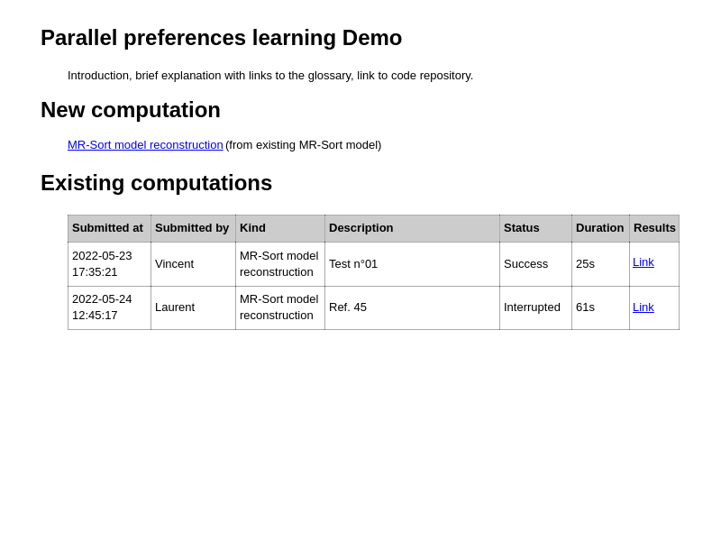
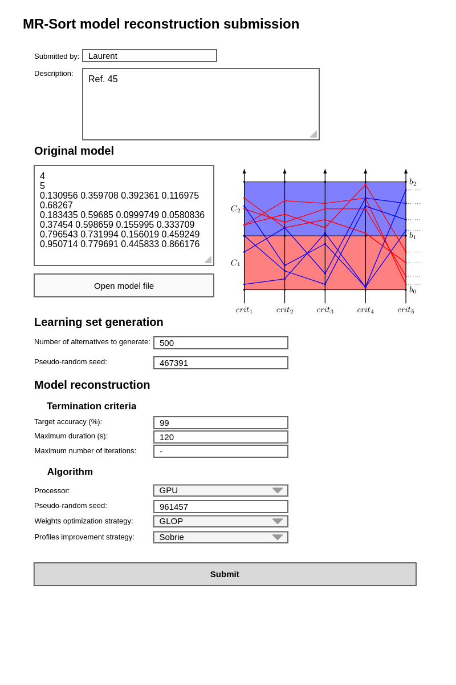
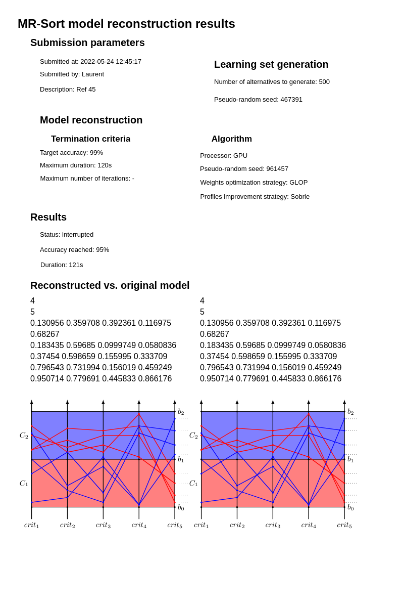

This file describes the first iteration of a web-based GUI, for validation by Laurent.

The main goal of this GUI is to make demos easier, and let people play with the underlying tools without having to install them.

Main use case: reconstitute a model
===================================

The user has an MR-sort model, and wants to:

- generate a pseudo-random learning set from this model
- learn a model from the learning set
- compare the reconstituted model with the initial one

Mock-ups
========

Landing page
------------

This page is at the root of the web application (path `/`).

<!-- Mockups in this document have been created using https://github.com/evolus/pencil. The primary file is mockups.epgz, and *.png files are exported using menu "Export..." -->

### "New computation" section

- the "MR-Sort model reconstruction" link takes the user to the "Submission" page described below
- there is only one kind of computation for now, but I expect this to change soon, so I already design the UI to allow it

### "Existing computations" section

- the "Description" column is a free text set when submitting the computation
- the "Status" column can have the following values:
    - Queued: the computation has been submitted but has not started yet
    - In progress: the computation has started
    - Success: the computation has finished and reached its goal
    - Interrupted: the computation took longer than allowed, but did not error
    - Error: the computation failed. The cause of the error is displayed
- the "Results" column is "-" for statuses "Queued" and "In progress". For other statuses, the link takes the user to the appropriate "Results" page described below
- the table is sorted by "Submitted at"
- there is no custom sorting
- there is no filtering

Submission page
---------------

This page is at path `/computations/submit/mrsort-reconstruction`.

### Preamble

- the "Submitted by" field is stored in a cookie to avoid having to type it every time
- the "Description" column is a free text used to attach any information to the computation (context, details, references, etc.)

### "Original model" section

- the model can be loaded from a file and/or edited in place using the syntax implemented by `ppl::io::Model`. I'll document that syntax properly during the development of this GUI
- the graph is updated live when the model is changed

### "Learning set generation" section

- the "Pseudo-random seed" field is initialized randomly by the GUI but can be overridden by the user

### "Model reconstruction" section

#### "Termination criteria" sub-section

- this section list all the criteria that can terminate the computation, similarly to the command-line of the `learn-model` tool
- computation is terminated as soon as the first criterion is met
- computation reaches state "Success" if that criterion is the "Target accuracy", and state "Interrupted" otherwise

#### "Algorithm" sub-section

- in this section, the user can tweak all aspects of the algorithm used
- it will evolve as more policies are added to the project

### Footer

- the "Submit" button redirects to the "Results" page described below

Results page
------------

This page is at path `/computations/<id>` where `id` is an opaque identifier made of 8 letters and digits.

- for a queued or in progress computation, the "Results" section is replaced by the following message: "Computation in progress. This page automatically refreshes every 10 seconds. You can also come back later."
- for a failed computation: "Computation failed" + error message.
